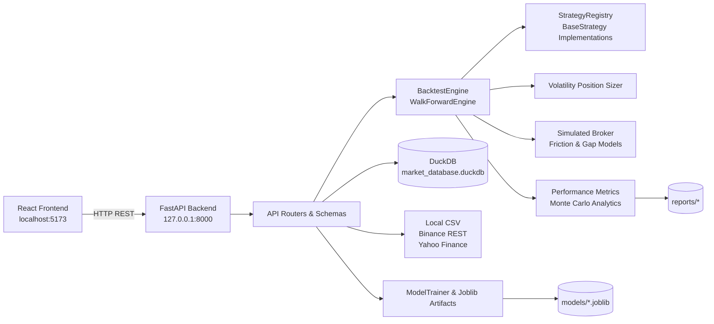

# ASTRA

ASTRA is a local-first quantitative research platform for evaluating systematic trading strategies through historical event-driven backtesting, walk-forward validation, Monte Carlo stress analysis, supervised machine-learning classification, and an interactive browser-based inspection UI. The repository combines a high-performance Python simulation engine, DuckDB-backed columnar market-data persistence, a FastAPI REST service, and a React workspace.

ASTRA is an academic and research-oriented framework designed to support quantitative experimentation, methodology validation, and econometric benchmarking. It operates as an offline simulation laboratory incorporating realistic execution frictions and does not connect to live brokerage accounts or order routing networks.

## Table of Contents

- [ASTRA](#astra)
	- [Table of Contents](#table-of-contents)
	- [Research Scope and Non-Goals](#research-scope-and-non-goals)
	- [Key Capabilities](#key-capabilities)
	- [Typical Workflows](#typical-workflows)
	- [System Architecture](#system-architecture)
	- [Backend Engine Architecture](#backend-engine-architecture)
		- [Runtime Execution Lifecycle](#runtime-execution-lifecycle)
	- [Frontend Operator Workspace](#frontend-operator-workspace)
	- [Technology and Stack Matrix](#technology-and-stack-matrix)
		- [Backend Components](#backend-components)
		- [Frontend Components](#frontend-components)
		- [Development \& Tooling](#development--tooling)
	- [Repository Directory Layout](#repository-directory-layout)
	- [Prerequisites \& System Requirements](#prerequisites--system-requirements)
	- [Installation From Zero](#installation-from-zero)
	- [Local Startup Guide](#local-startup-guide)
		- [Dual-Process Development Workflow (Recommended for Active Development)](#dual-process-development-workflow-recommended-for-active-development)
			- [Terminal 1: Backend API Service](#terminal-1-backend-api-service)
			- [Terminal 2: Frontend Operator Workspace](#terminal-2-frontend-operator-workspace)
		- [Single-Process Production Preview](#single-process-production-preview)
		- [Primary Access URLs](#primary-access-urls)
	- [First-Use Step-by-Step Walkthrough](#first-use-step-by-step-walkthrough)
	- [Implemented Strategy Architectures](#implemented-strategy-architectures)
	- [Risk Management \& Execution Microstructure](#risk-management--execution-microstructure)
	- [Data Sources, Persistence \& Artifact Lifecycle](#data-sources-persistence--artifact-lifecycle)
		- [Ingestion Engines](#ingestion-engines)
		- [Persistence Layer \& Generated Artifacts](#persistence-layer--generated-artifacts)
	- [API Architecture \& Endpoints](#api-architecture--endpoints)
	- [Runtime Configuration \& Parameter Defaults](#runtime-configuration--parameter-defaults)
	- [Operational \& Automation Commands](#operational--automation-commands)
		- [1. Market Data Management](#1-market-data-management)
		- [2. Machine Learning Training \& Verification](#2-machine-learning-training--verification)
		- [3. Academic Benchmarking Suite](#3-academic-benchmarking-suite)
		- [4. Reporting \& Publication Plot Generation](#4-reporting--publication-plot-generation)
	- [Validation and Quality Assurance](#validation-and-quality-assurance)
	- [Architectural \& Quantitative Design Decisions](#architectural--quantitative-design-decisions)
	- [Deterministic Reproducibility](#deterministic-reproducibility)
	- [Security and Deployment Scope](#security-and-deployment-scope)
		- [Cloud Web Service Configuration (Render / PaaS)](#cloud-web-service-configuration-render--paas)
	- [Operational Troubleshooting Matrix](#operational-troubleshooting-matrix)
	- [Documentation References](#documentation-references)
	- [Author](#author)

---

## Research Scope and Non-Goals

| Area | Current Implementation Scope |
| :--- | :--- |
| **Primary Purpose** | Quantitative strategy research, friction drag quantification, and academic benchmarking. |
| **Supported Evaluation Modes** | Single-run backtesting, A/B strategy comparison, expanding rolling walk-forward validation, out-of-sample persistence audits, Monte Carlo stress testing, and ML classification. |
| **Intended Runtime** | Local workstation, evaluation container, or institutional research environment. |
| **Explicit Non-Goals** | Live order routing, direct exchange connectivity, multi-tenant custody, and real-time portfolio execution. |

*Methodological Notice:* ASTRA simulates trade executions against historical market bars incorporating modeled commissions, slippage, and execution delays. Backtested metrics reflect statistical expectancy under controlled conditions.

---

## Key Capabilities

- **Strict Event-Driven Simulation:** Eliminates lookahead bias by executing signals on the opening price of the immediately subsequent bar ($t+1$).
- **Dynamic Volatility Position Sizing:** Automatically computes position quantities using fractional equity risk and $ATR_{14}$-scaled stop distances.
- **Embedded Columnar Data Persistence:** Leverages DuckDB for local OHLCV caching and low-latency feature extraction.
- **Multi-Source Market Data Engine:** Unified interface retrieving data from local institutional CSVs, Binance public REST endpoints (crypto), and Yahoo Finance (equities/ETFs).
- **Temporal Robustness & Walk-Forward:** Assesses parameter stability via Walk-Forward Efficiency Ratio ($WFER$) and out-of-sample degradation matrices.
- **Non-Parametric Stress Testing:** Computes empirical $\text{VaR}_{95\%}$, $\text{CVaR}_{95\%}$, and Risk of Ruin using 1,000 Monte Carlo bootstrap iterations.
- **Machine Learning Integration:** Implements the Triple-Barrier Method, dynamic CUSUM volatility filtering, and Purged K-Fold Cross-Validation.
- **Interactive Single-Page UI:** Modular React dashboard providing synchronized price action inspection, execution markers, and alpha attribution deltas.

---

## Typical Workflows

| Research Workflow | Description | Primary Entry Points |
| :--- | :--- | :--- |
| **Single Strategy Evaluation** | Execute backtest on an asset/timeframe, inspecting trades, equity trajectory, and benchmark comparison. | UI `Auditoría de rendimiento`, `POST /api/backtest/run` |
| **A/B Strategy Comparison** | Run two models side-by-side on identical historical data to evaluate alpha spread ($\Delta A - B$). | UI `Benchmark de modelos`, `POST /api/backtest/compare` |
| **Out-of-Sample (OOS) Audit** | Partition trade sequence chronologically into calibration vs evaluation windows to calculate $WFER$. | UI `Walk-Forward y OOS`, `POST /api/backtest/oos-audit` |
| **Rolling Walk-Forward Analysis** | Execute sequential re-calibration windows across multi-year historical regimes. | `POST /api/backtest/walk-forward`, CLI benchmark scripts |
| **Monte Carlo Stress Analysis** | Resample realized trade series to evaluate tail risk, maximum drawdown cones, and ruin probabilities. | UI `Pruebas de estrés y MC`, Monte Carlo engine |
| **Machine Learning Pipeline** | Train gradient boosting models with purged cross-validation and serialize `.joblib` weights. | `scripts/ml/train_ml_models.py`, `src/ml_engine/` |
| **Academic Artifact Generation** | Compile empirical benchmark results, summary tables, and distribution plots for thesis documentation. | `scripts/benchmark/*`, `scripts/reporting/*` |

---

## System Architecture



---

## Backend Engine Architecture

The backend is built with Python 3.12 and FastAPI under `src/`, exposing typed analytical services initialized from `src.api.main:app`. The system integrates modular subpackages for data loading, event processing, feature extraction, and risk assessment.

### Runtime Execution Lifecycle
1. **Request Intake & Schema Validation:** Validates symbol, timeframe, date range, risk fraction, and friction parameters via Pydantic.
2. **Data Layer Verification:** Checks in-memory cache and queries `data/market_database.duckdb`. Missing bars are ingested via `UnifiedDataLoader` and cached.
3. **Strategy Initialization:** Dynamically instantiates the requested strategy from `StrategyRegistry` with user-defined parameters.
4. **Event-Driven Backtest Loop:** Iterates chronologically through OHLCV bars:
   - Evaluates indicator state and generates `SignalEvent`.
   - `SimulatedBroker` sizes orders via `VolatilityPositionSizer` ($ATR_{14}$).
   - Executes fills at the next bar's open ($t+1$), applying commissions, spread, and gap penalties.
   - Monitors intrabar stop-loss and take-profit thresholds.
5. **Analytics & Monte Carlo Engine:** Computes CAGR, Sharpe, Sortino, Calmar, Alpha, Beta, and launches 1,000 bootstrap resampling simulations.
6. **Payload Serialization:** Streams optimized JSON responses containing OHLCV history, equity series, execution markers, and risk distributions.

---

## Frontend Operator Workspace

The frontend is a single-page React 19 application located in `frontend/`. It provides five dedicated analytical workspaces:

| UI Workspace (Spanish) | Internal Tab | Functional Scope |
| :--- | :--- | :--- |
| **Registro de estrategias** | `studio` | Strategy catalog selector, parameter forms, AST condition constructor, broker friction modeling, and persistent preset management. |
| **Auditoría de rendimiento** | `performance` | Synchronized OHLCV candlestick chart, execution markers, equity curve vs. buy-and-hold benchmark, and granular transaction audit table. |
| **Pruebas de estrés y MC** | `stress_testing` | Bootstrap simulation bands, probability of ruin distributions, and empirical $\text{VaR}_{95\%}$ / $\text{CVaR}_{95\%}$ metrics. |
| **Walk-Forward y OOS** | `validation` | Real-time In-Sample / Out-of-Sample temporal splitting (WFER ratio) alongside the academic benchmark degradation matrix. |
| **Benchmark de modelos** | `comparison` | Head-to-head multi-model comparison, statistical alpha spread ($\Delta A - B$), and overlaid equity trajectories. |

---

## Technology and Stack Matrix

### Backend Components
| Technology | Role & Implementation |
| :--- | :--- |
| **Python 3.12** | Core execution runtime. |
| **FastAPI & Uvicorn** | Asynchronous HTTP REST API and ASGI development server. |
| **Pydantic v2** | Request/response schema contracts and settings validation. |
| **Pandas & NumPy** | High-performance tabular calculations and vectorized indicator logic. |
| **DuckDB** | Columnar embedded SQL database for local OHLCV storage. |
| **Scikit-Learn & Optuna** | Machine learning classification models and Bayesian hyperparameter tuning. |
| **Joblib** | Model weight serialization and disk persistence. |
| **Requests & yfinance** | External REST data acquisition from Binance and Yahoo Finance APIs. |

### Frontend Components
| Technology | Role & Implementation |
| :--- | :--- |
| **React 19 & TypeScript 6** | Component-driven UI framework with strict type safety. |
| **Vite 8** | Next-generation build tool and development server with HMR. |
| **Recharts** | Declarative financial data visualization (Candlesticks, Areas, Scatters). |
| **Tailwind CSS 4** | Utility-first responsive styling framework. |
| **Lucide React** | Icon library for analytical UI controls. |
| **Axios** | HTTP client handling asynchronous communication with FastAPI. |

### Development & Tooling
| Tool | Purpose |
| :--- | :--- |
| **uv** | Fast Python dependency resolver and virtual environment manager. |
| **pytest** | Automated test runner for unit, integration, and backtest tests. |
| **Ruff & Mypy** | High-speed Python linter and static type checker. |
| **ESLint** | Frontend TypeScript and JSX code quality analyzer. |

---

## Repository Directory Layout

```
ASTRA/
├── config/                 # YAML configuration baselines
├── data/                   # DuckDB database, historical CSVs, and runtime presets
│   ├── historical/         # Offline institutional sample data (e.g., SPY_4h.csv)
│   ├── market_database.duckdb # Primary columnar OHLCV store
│   └── presets.json        # Serialized user strategy presets
├── docs/                   # Academic documentation, methodology, and architecture
├── frontend/               # React / TypeScript operator workspace
│   ├── src/
│   │   ├── components/     # UI panels, tables, and custom Recharts SVG shapes
│   │   ├── context/        # BacktestContext state provider and cache manager
│   │   ├── types/          # TypeScript interfaces and schema contracts
│   │   └── utils/          # Numeric, currency, and UTC date formatters
│   └── package.json
├── models/                 # Serialized machine learning models (*.joblib)
├── reports/                # Benchmark JSON/Markdown results, LaTeX tables, and plots
├── scripts/
│   ├── benchmark/          # Academic benchmark CLI runners
│   ├── data/               # Market data acquisition and synchronization scripts
│   ├── ml/                 # Machine learning training and verification pipelines
│   └── reporting/          # Plot generation scripts for academic reports
├── src/                    # Core backend packages
│   ├── analytics/          # Metrics, trade statistics, and Monte Carlo resampling
│   ├── api/                # FastAPI routers, dependencies, and schemas
│   ├── backtester/         # Event-driven engine, broker simulation, and order execution
│   ├── data_engine/        # Loaders (Binance, YFinance, CSV) and DuckDB storage
│   ├── ml_engine/          # Feature engineering, Triple-Barrier labeling, and trainer
│   ├── risk/               # Volatility position sizing and ATR risk managers
│   └── strategies/         # Strategy registry and implementation classes
├── tests/                  # Unit, analytics, and strategy regression test suite
├── pyproject.toml          # Python project dependencies and build configuration
└── uv.lock                 # Deterministic dependency lockfile
```

---

## Prerequisites & System Requirements

| Requirement | Specification | Notes |
| :--- | :--- | :--- |
| **Python** | `3.12.x` | Required by `pyproject.toml` metadata constraints (`>=3.12,<3.13`). |
| **Package Manager** | `uv` (`>=0.4.0`) | Recommended for high-speed deterministic environment installation. |
| **Node.js & npm** | `^20.19.0` or `>=22.12.0` | Required for building and running the Vite 8 frontend workspace. |
| **Git** | Standard Git client | Required to clone repository and manage submodules. |
| **Operating System** | Linux, macOS, Windows (WSL2) | Cross-platform compatible. |

---

## Installation From Zero

Clone the repository, create the virtual environment using `uv`, sync Python dependencies, and install frontend packages:

```bash
# 1. Clone repository
git clone <repository-url>
cd ASTRA

# 2. Setup Python virtual environment and dependencies via uv
uv python install 3.12
uv sync --all-groups

# 3. Setup Frontend dependencies
cd frontend
npm ci
cd ..
```

---

## Local Startup Guide

### Dual-Process Development Workflow (Recommended for Active Development)
Run the backend and frontend services in separate terminal windows with hot reloading:

#### Terminal 1: Backend API Service
```bash
# From the root directory with virtual environment active
uv run uvicorn src.api.main:app --reload --host 0.0.0.0 --port 8000
```

#### Terminal 2: Frontend Operator Workspace
```bash
# From the frontend directory
cd frontend
npm run dev
```

### Single-Process Production Preview
Build the React production bundle and run the entire unified stack on port 8000:
```bash
# 1. Build frontend distribution assets
cd frontend && npm run build && cd ..

# 2. Start unified FastAPI server
uv run uvicorn src.api.main:app --host 0.0.0.0 --port 8000
```

### Primary Access URLs
- **Frontend Dashboard (Dev Server):** `http://localhost:5173`
- **Unified Web Platform (Production):** `http://localhost:8000`
- **Interactive Swagger API Documentation:** `http://127.0.0.1:8000/docs`
- **ReDoc API Documentation:** `http://127.0.0.1:8000/redoc`

---

## First-Use Step-by-Step Walkthrough

1. Complete the installation and start both Backend and Frontend services.
2. Open `http://localhost:5173` in your browser.
3. The workspace automatically fetches registered strategies, loads user presets, and runs the baseline backtest scenario (`BTC-USD`, `4h`, `regime_volatility_breakout`).
4. In **Registro de estrategias** (`Strategy Studio`), modify asset selection, resolution (`1d` or `4h`), or adjust friction parameters (e.g., commissions to $5\text{ bps}$, slippage to $2\text{ bps}$).
5. Click **Run Simulation** (or use the Global Ribbon) to execute the event-driven backtest.
6. Navigate to **Auditoría de rendimiento** (`Performance Audit`) to inspect the candlestick chart, entry/exit markers, drawdown cones, and granular trade records.
7. Open **Pruebas de estrés y MC** to review the 1,000-iteration Monte Carlo confidence bands and tail risk estimates ($\text{CVaR}_{95\%}$).
8. Access **Walk-Forward y OOS** to evaluate the In-Sample / Out-of-Sample temporal split and review the 24-configuration academic degradation matrix.
9. Open **Benchmark de modelos** to run a head-to-head comparison between two strategies and compute the statistical alpha spread ($\Delta A - B$).

---

## Implemented Strategy Architectures

ASTRA includes four production-grade quantitative architectures and a visual rule constructor registered in `StrategyRegistry`:

| Strategy ID | Display Name | Core Hypothesis & Methodological Logic |
| :--- | :--- | :--- |
| `trend_following_ema` | **Dual EMA Momentum** | Captures medium-term directional trends using fast/slow exponential moving average crossovers, exiting upon trend exhaustion. |
| `regime_volatility_breakout` | **Adaptive Volatility Breakout** | Donchian channel breakout strategy filtered by ADX trend strength ($ADX > 25$) and dynamic volume surge multipliers. |
| `statistical_mean_reversion` | **Statistical Z-Score Reversion** | Identifies price overextension using rolling Z-Score boundaries ($Z < -2.0$) confirmed by short-period RSI oscillators. |
| `ml_inference` | **ML Triple-Barrier Inference** | Directional classification strategy using gradient boosting to predict profit barrier touches scaled dynamically by daily volatility. |
| `custom_rule_strategy` | **AST Custom Rule Constructor** | Dynamic rule evaluator combining user-defined indicator conditions configured directly in the Strategy Studio. |

---

## Risk Management & Execution Microstructure

ASTRA models real-world execution constraints to prevent unrealistic backtest assumptions:

| Microstructural Dimension | Engine Implementation |
| :--- | :--- |
| **Execution Timing** | Signals triggered at bar close $t$ execute on the opening price of bar $t+1$ (strictly next-bar execution). |
| **Intrabar Barrier Evaluation** | Evaluates high and low prices against dynamic Take-Profit ($k_{TP} \cdot ATR$) and Stop-Loss ($k_{SL} \cdot ATR$) levels. |
| **Discontinuous Gap Handling** | If market opens beyond the stop-loss level, orders fill at the open price rather than the stop level (gap slippage penalty). |
| **Transaction Frictions** | Applies configurable basis points ($\text{bps}$) for proportional brokerage commissions and adverse market slippage. |
| **Position Sizing Engine** | Computes position size as: $\text{Quantity} = \frac{\text{Equity} \cdot \text{RiskFraction}}{k_{SL} \cdot ATR_{14} \cdot \text{EntryPrice}}$, capped by total available liquidity. |
| **Capital Protection** | Restricts cash allocations with a $2\%$ margin buffer to prevent margin calls or over-leveraging. |

*Default Configuration:* Initial Capital: $\$100,000$, Risk Fraction: $1\%$, $k_{SL} = 2.0\text{x } ATR$, $k_{TP} = 4.0\text{x } ATR$, Commission: $5.0\text{ bps}$, Slippage: $2.0\text{ bps}$.

---

## Data Sources, Persistence & Artifact Lifecycle

### Ingestion Engines
| Source | Resolution & Universe | Priority & Behavior |
| :--- | :--- | :--- |
| **Local File Loader** | Institutional CSVs (`SPY_4h`, etc.) | First priority: loads pre-cleaned offline historical bars instantly. |
| **Binance REST API** | Cryptoassets (`BTC-USD`, `ETH-USD`, etc.) | Queries public Binance endpoints with automated pagination for $2021\text{--}2025$ coverage. |
| **Yahoo Finance Loader** | Equities, ETFs, and Macro Indices | Fallback loader for daily and multi-year asset series. |

### Persistence Layer & Generated Artifacts
| Artifact Type | Storage Location | Description |
| :--- | :--- | :--- |
| **Market Data Database** | `data/market_database.duckdb` | Columnar database caching normalized OHLCV time series. |
| **Strategy Presets** | `data/presets.json` | JSON store containing user-defined strategy rules and friction profiles. |
| **ML Model Artifacts** | `models/*.joblib` | Serialized scikit-learn / HistGradientBoosting classifiers and feature schemas. |
| **Benchmark Outputs** | `reports/academic_benchmark_*` | Automated JSON, Markdown, and LaTeX tables generated for academic reporting. |
| **Visualization Plots** | `reports/plots/*.png` | High-resolution publication plots (IS vs. OOS, Monte Carlo distributions, etc.). |

---

## API Architecture & Endpoints

All endpoints are organized under `/api/backtest` and documented via OpenAPI Swagger:

| HTTP Method | Route | Description |
| :--- | :--- | :--- |
| `GET` | `/api/backtest/strategies` | Retrieves metadata, categories, and parameter schemas for all registered strategies. |
| `GET` | `/api/backtest/presets` | Retrieves all saved user strategy presets and risk configurations. |
| `POST` | `/api/backtest/presets` | Creates or updates a persistent strategy preset. |
| `DELETE` | `/api/backtest/presets/{name}` | Deletes a persistent strategy preset by name. |
| `POST` | `/api/backtest/run` | Executes an event-driven backtest simulation, returning trade logs, equity curves, and MC analysis. |
| `POST` | `/api/backtest/compare` | Executes a head-to-head comparative simulation between Model A and Model B with alpha attribution. |
| `POST` | `/api/backtest/oos-audit` | Evaluates In-Sample vs. Out-of-Sample temporal partitioning and calculates $WFER$ on demand. |

---

## Runtime Configuration & Parameter Defaults

ASTRA standardizes runtime parameters across its backend and frontend environments:

- **Active Benchmark Universe:** `BTC-USD`, `ETH-USD`, `SPY` across `1d` and `4h` timeframes.
- **Evaluation Period:** Full historical range from $2021\text{--}2025$ (2021 warmup, 2022–2025 out-of-sample evaluation).
- **Execution Defaults:** Starting Capital: $\$100,000.00$, Risk per Trade: $1.0\%$, Stop Loss: $2.0 \cdot ATR_{14}$, Take Profit: $4.0 \cdot ATR_{14}$.
- **Friction Standards:** Crypto assets: $5.0\text{ bps}$ commission, $2.0\text{ bps}$ adverse slippage.

---

## Operational & Automation Commands

### 1. Market Data Management
```bash
# Fetch and synchronize initial historical datasets into DuckDB
uv run python scripts/data/fetch_initial_data.py
```

### 2. Machine Learning Training & Verification
```bash
# Train HistGradientBoosting models using Purged K-Fold Cross-Validation
uv run python scripts/ml/train_ml_models.py

# Verify ML feature engineering pipeline and barrier labeling
uv run python scripts/ml/verify_ml_pipeline.py
```

### 3. Academic Benchmarking Suite
```bash
# Run the complete 24-configuration academic benchmark matrix
uv run python scripts/benchmark/run_academic_benchmark.py
```

### 4. Reporting & Publication Plot Generation
```bash
# Generate IS vs OOS Sharpe degradation scatter plots (Figure 5.3)
uv run python scripts/reporting/plot_sharpe_ratio_degradation_is_vs_oos.py

# Generate Monte Carlo distribution and CVaR95 risk plots (Figure 5.4)
uv run python scripts/reporting/plot_monte_carlo_return_distribution_and_cvar95.py

# Generate comparative strategy equity curves (Figure 5.1 & 5.2)
uv run python scripts/reporting/plot_btc_strategy_comparison.py

# Generate timeframe performance comparison (1d vs 4h)
uv run python scripts/reporting/plot_sharpe_ratio_timeframe_degradation_1d_vs_4h.py
```

---

## Validation and Quality Assurance

Execute the verification commands across Python backend and TypeScript frontend:

```bash
# Run backend test suite
uv run pytest

# Execute Python static linting
uv run ruff check .

# Execute Python strict type checking
uv run mypy .

# Execute frontend TypeScript linting & compilation
cd frontend
npm run lint
npm run build
cd ..
```

---

## Architectural & Quantitative Design Decisions

- **Local-First Data Architecture:** Eliminates external network latency and rate-limit bottlenecks by embedding DuckDB for high-throughput columnar storage.
- **Event-Driven Causality:** Avoids vectorized backtesting biases by dispatching discrete market events to simulated brokers and strategies bar-by-bar.
- **Microstructural Friction Accounting:** Integrates proportional commission, fixed broker fees, dynamic slippage, and gap penalties directly into the matching engine.
- **Decoupled Strategy Registry:** Implements the Strategy Pattern via `@StrategyRegistry.register`, enabling seamless addition of algorithmic models without modifying engine internals.
- **Non-Parametric Risk Attribution:** Implements Monte Carlo bootstrap resampling rather than assuming Gaussian return distributions, providing realistic tail risk measures ($\text{CVaR}_{95\%}$).

---

## Deterministic Reproducibility

- **Dependency Pinning:** Managed via `uv.lock` and `package-lock.json` for reproducible builds across operating systems.
- **Random Seed Control:** Stochastic algorithms (Monte Carlo resampling, Purged K-Fold CV, Optuna TPE samplers) utilize explicit seed constants (`random_seed=42`).
- **Standardized Time Coordinates:** All internal date indexes, tick timestamps, and transaction logs strictly normalize to Coordinated Universal Time (UTC).

---

## Security and Deployment Scope

ASTRA is built primarily as a research workstation, with single-service production deployment capabilities:
- The backend binds to local interfaces or dynamic container ports (`$PORT`) for host flexibility.
- Deserialization of `.joblib` model weights is restricted to internal artifacts in the `models/` directory.
- Static file routing resolves `frontend/dist` automatically, allowing unified deployment on cloud providers (e.g., Render Web Service).
- CORS middleware is enabled to permit communication across local Vite (`localhost:5173`) and FastAPI (`127.0.0.1:8000`) instances.

### Cloud Web Service Configuration (Render / PaaS)
- **Runtime:** `Python 3.12`
- **Build Command:** `cd frontend && npm install && npm run build && cd .. && uv sync --no-dev`
- **Start Command:** `uv run uvicorn src.api.main:app --host 0.0.0.0 --port $PORT`

---

## Operational Troubleshooting Matrix

| Issue / Symptom | Probable Cause | Corrective Action |
| :--- | :--- | :--- |
| **Frontend displays connection error** | FastAPI backend is not running on port `8000`. | Start backend via `uv run uvicorn src.api.main:app --reload --port 8000` and verify `http://127.0.0.1:8000/docs`. |
| **DuckDB query returns 0 bars** | Requested asset/timeframe has not been cached locally. | Ensure internet access during initial run so `UnifiedDataLoader` can fetch and cache bars in `data/market_database.duckdb`. |
| **Recharts UI lag on long timelines** | Rendering thousands of SVG nodes simultaneously. | Use the viewport zoom selector in `Auditoría de rendimiento` (e.g., 150–300 bars) for smooth 60 FPS inspection. |
| **Python import error on plotting scripts** | Virtual environment dependencies not fully synchronized. | Execute `uv sync --all-groups` from the project root directory. |
| **Model loading error in ML strategy** | Serialized model artifact not found in `models/`. | Run `uv run python scripts/ml/train_ml_models.py` to regenerate model weights. |

---

## Documentation References

- [System Architecture & Engine Design](docs/architecture.md)
- [Quantitative Methodology & Econometric Models](docs/methodology.md)
- [Frontend Developer Documentation](frontend/README.md)

---

## Author

**Víctor Novelle**  