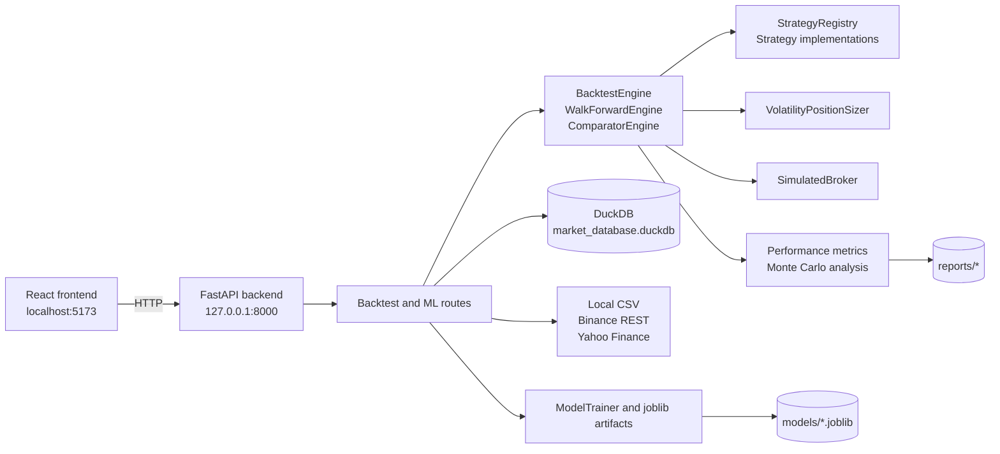

# ASTRA

ASTRA is a local-first quantitative research platform for evaluating systematic trading ideas through historical backtesting, walk-forward validation, Monte Carlo stress analysis, machine-learning model training, and a browser-based inspection UI. In its current form, the repository combines a Python event-driven simulation engine, DuckDB-backed market-data storage, a FastAPI backend, and a React frontend that lets an evaluator run and inspect strategy experiments without needing prior project context.

ASTRA is an academic and research-oriented codebase. Its goal is to support experimentation, benchmarking, and methodology review. It is not a live-trading system, does not place real orders, does not include portfolio custody or broker connectivity, and should not be treated as investment advice or a production deployment baseline.

## Table of Contents

- [Project Status](#project-status)
- [Research Scope and Non-Goals](#research-scope-and-non-goals)
- [Key Capabilities](#key-capabilities)
- [Typical Workflows](#typical-workflows)
- [Architecture](#architecture)
- [Backend](#backend)
- [Frontend](#frontend)
- [Technology and Libraries](#technology-and-libraries)
- [Repository Layout](#repository-layout)
- [Prerequisites](#prerequisites)
- [Installation From Zero](#installation-from-zero)
- [Local Startup](#local-startup)
- [First-Use Walkthrough](#first-use-walkthrough)
- [Implemented Strategies](#implemented-strategies)
- [Risk and Execution Assumptions](#risk-and-execution-assumptions)
- [Data Sources Persistence and Artifacts](#data-sources-persistence-and-artifacts)
- [API Overview](#api-overview)
- [Configuration and Defaults](#configuration-and-defaults)
- [Operational Commands](#operational-commands)
- [Validation](#validation)
- [Design Decisions](#design-decisions)
- [Reproducibility](#reproducibility)
- [Security and Deployment Caveats](#security-and-deployment-caveats)
- [Known Limitations](#known-limitations)
- [Troubleshooting](#troubleshooting)
- [Documentation Links](#documentation-links)
- [Contribution Checklist](#contribution-checklist)
- [Author](#author)
- [License Status](#license-status)

## Project Status

ASTRA is currently best described as an active research prototype with working backend and frontend surfaces, benchmark scripts, persisted sample artifacts, and test coverage under development. The repository already contains runnable simulations, model artifacts, benchmark outputs, and a local UI, but it is not hardened as a production service and should be evaluated with that boundary in mind.

## Research Scope and Non-Goals

| Area | Current Scope |
| --- | --- |
| Primary purpose | Quantitative strategy research, methodology evaluation, and academic demonstration |
| Supported evaluation modes | Single backtest, A/B strategy comparison, walk-forward validation, out-of-sample audit, Monte Carlo stress analysis, ML model training and inference |
| Intended runtime | Local development workstation or evaluator machine |
| Explicit non-goals | Live execution, brokerage integration, authentication, multi-user operations, cloud deployment hardening, secrets management, compliance workflows |

Important disclaimer: ASTRA simulates execution against historical data with modeled friction. It does not prove real-world tradability, liquidity access, or production readiness.

## Key Capabilities

- Historical event-driven backtesting with next-bar execution and explicit transaction-cost modeling.
- Volatility-based position sizing using ATR-derived stop-loss and take-profit levels.
- Local caching and persistence of OHLCV data in DuckDB.
- Data loading from local CSV, Binance public REST data for crypto, and Yahoo Finance for equities and ETFs.
- Walk-forward validation and out-of-sample audit metrics.
- Monte Carlo stress testing on realized trade streams.
- ML model training with triple-barrier labels and purged cross-validation.
- Saved strategy presets and model artifacts on disk.
- React frontend for exploratory evaluation across performance, stress, validation, and comparison views.

## Typical Workflows

| Workflow | What you do | Main entry points |
| --- | --- | --- |
| Evaluate one strategy | Run one backtest on one symbol and inspect trades, equity, and benchmark comparison | Frontend, `POST /api/backtest/run` |
| Compare two strategies | Run strategy A vs B on identical data and compare attribution metrics | Frontend comparison view, `POST /api/backtest/compare` |
| Audit one result out of sample | Split the active result chronologically and inspect the static academic matrix | Frontend `Walk-Forward y OOS` view |
| Run rolling validation | Execute the backend expanding-window procedure; this is not currently called by the frontend | `POST /walk-forward` |
| Stress-test outcomes | Inspect Monte Carlo drawdown and ruin-risk distributions from realized trades | Backtest response Monte Carlo payload, stress-testing frontend view |
| Train ML artifacts | Run the offline trainer; the mounted HTTP training route is currently broken | `scripts/ml/train_ml_models.py`; non-operational `POST /ml/train` |
| Produce academic artifacts | Generate benchmark summaries and plots | `scripts/benchmark/*`, `scripts/reporting/*` |

## Architecture



## Backend

The backend lives under `src/` and exposes a FastAPI application from `src.api.main:app`. The primary evaluator workflow uses the `/api/backtest/*` family for strategy metadata, preset management, single-run backtests, strategy comparison, and OOS audit. Additional unprefixed routes and `/ml/*` routes also exist and are mounted in the same FastAPI app.

At runtime, the main data path is:

1. Load cached bars from in-memory request cache when available.
2. Read stored OHLCV rows from `data/market_database.duckdb`.
3. Fetch missing or insufficient data from local CSV, Binance, or Yahoo Finance.
4. Persist fetched bars back into DuckDB.
5. Instantiate the requested strategy via `StrategyRegistry`.
6. Run the event-driven backtest engine with volatility sizing and simulated execution costs.
7. Derive performance metrics, benchmark comparison, trade analytics, and Monte Carlo output.
8. Return structured JSON to the frontend or CLI caller.

Backend capabilities evidenced in code include:

- Single-symbol backtests with OHLCV input.
- Benchmarking against a buy-and-hold equity curve.
- Strategy A/B comparison under shared conditions.
- Walk-forward validation through `WalkForwardEngine`.
- Out-of-sample audit on an existing equity curve split.
- Working offline ML model training and mounted model-artifact discovery.

The mounted `POST /ml/train` endpoint is not operational in the current revision: it calls a
missing `StorageManager.load_bars()` method. Use `scripts/ml/train_ml_models.py` for training.

## Frontend

The frontend is a Vite + React + TypeScript application in `frontend/`. It does not currently use an environment variable for the backend base URL. The API host is hard-coded to `http://127.0.0.1:8000` in the frontend source, so backend and frontend startup are coupled to that local address unless the code is changed.

Current top-level frontend workspaces use these Spanish UI names:

| UI name | Purpose |
| --- | --- |
| `Registro de estrategias` | Configure strategy, asset, timeframe, and presets |
| `Auditoría de rendimiento` | Review backtest performance, timeline, and trade analytics |
| `Pruebas de estrés y MC` | Inspect Monte Carlo and stress-test metrics |
| `Walk-Forward y OOS` | Inspect a client-side IS/OOS split and a static academic matrix; it does not call `/walk-forward` |
| `Benchmark de modelos` | Compare two strategies side by side |

Observed frontend behavior relevant to evaluators:

- On initial load, it requests strategies and presets from the backend and then auto-runs a simulation.
- The default frontend scenario is `BTC-USD`, timeframe `4h`, strategy `regime_volatility_breakout`, with a dynamic trailing three-year date range.
- Preset save/delete actions currently target `/api/backtest/presets`, not the unprefixed preset endpoints.

## Technology and Libraries

The table below only attributes roles that are directly evidenced by the current repository code.

### Backend

| Technology | Evidenced role |
| --- | --- |
| Python 3.12 | Main backend runtime required by project metadata |
| FastAPI | HTTP API application and route definitions |
| Uvicorn | Local ASGI server for development startup |
| Pydantic and pydantic-settings | Request/response schemas and settings model |
| pandas | Core tabular data handling across loaders, analytics, engine, and ML |
| numpy | Numerical work in analytics, Monte Carlo, labeling, optimization, and tests/scripts |
| DuckDB | Local persistence for OHLCV data and one preset storage path |
| yfinance | Equity and ETF market-data loader |
| requests | Binance public REST requests in the crypto loader |
| scikit-learn | ML estimators and metrics |
| optuna | Hyperparameter optimization path in ML training |
| joblib | Serialized model artifact loading and saving |

### Frontend

| Technology | Evidenced role |
| --- | --- |
| React | Component-based UI |
| TypeScript | Typed frontend application code |
| Vite | Frontend dev server and production build tool |
| Axios | HTTP client for backend requests |
| Recharts | Performance and comparison visualizations |
| Lucide React | UI icons |
| Tailwind CSS | Utility-class styling |

### Quality and Tooling

| Technology | Evidenced role |
| --- | --- |
| uv | Python version management and dependency sync |
| pytest | Test runner |
| ruff | Python linting |
| mypy | Strict Python static typing baseline |
| ESLint | Frontend linting |
| TypeScript compiler | Frontend type-check/build step |
| npm | Frontend dependency and script runner |

## Repository Layout

| Path | Purpose |
| --- | --- |
| `src/` | Backend packages: analytics, API, backtester, data, execution, features, ML, risk, strategies |
| `src/api/` | FastAPI app, routers, and schemas |
| `frontend/` | React/Vite frontend application |
| `scripts/benchmark/` | CLI backtest and academic benchmark entry points |
| `scripts/data/` | Market-data acquisition helpers |
| `scripts/ml/` | ML training and pipeline verification helpers |
| `scripts/reporting/` | Plot generation scripts for benchmark/report outputs |
| `config/` | YAML config files kept in repo, but not the primary runtime control path |
| `data/` | DuckDB database, historical CSVs, and locally generated runtime artifacts |
| `models/` | Persisted `.joblib` ML model artifacts |
| `reports/` | Benchmark JSON, Markdown, LaTeX, and plots |
| `docs/` | Supplementary architecture and methodology documentation |
| `tests/` | Unit, integration, analytics, and strategy tests |

## Prerequisites

You need the following before installing ASTRA from scratch:

| Requirement | Notes |
| --- | --- |
| Python `3.12` exactly | The project metadata requires `>=3.12,<3.13` and this README standardizes on 3.12 |
| `uv` | Required for the documented installation workflow; the package itself uses standard Python metadata |
| Node.js `^20.19.0` or `>=22.12.0`, plus npm | Required by the installed Vite version; the repository does not otherwise pin Node |
| Git | Required to clone the repository |
| Network access | Needed for dependency installation and remote market-data fetches |
| Write access | Needed for `.venv`, DuckDB updates, `models/`, `reports/`, and frontend install artifacts |

Optional but currently undeclared extras:

- `matplotlib` is imported by the reporting scripts. The current lock resolves it transitively through `quantstats`, but it is not declared as a direct project dependency.
- `tvDatafeed` is imported by `scripts/data/download_spy_tv.py`, is not declared in `pyproject.toml`, and is installed from its upstream Git repository rather than PyPI.

## Installation From Zero

Clone the repository, install Python 3.12 via `uv`, sync all Python groups, then install frontend dependencies with `npm ci`.

```bash
git clone <repository-url>
cd ASTRA

uv python install 3.12
uv sync --all-groups

cd frontend
npm ci
cd ..
```

The current lock supplies `matplotlib` transitively. To run the optional TradingView downloader,
install its undeclared dependency from the upstream repository:

```bash
uv pip install "git+https://github.com/rongardF/tvdatafeed.git"
```

## Local Startup

Start the backend first, then the frontend.

1. Backend

```bash
uv run uvicorn src.api.main:app --reload --port 8000
```

2. Frontend

```bash
cd frontend
npm run dev
```

Primary local URLs:

- FastAPI OpenAPI docs: `http://127.0.0.1:8000/docs`
- Frontend app: `http://localhost:5173`

Why this order matters: the frontend immediately requests strategy and preset metadata from the backend and will show connection failures if the API is not already running.

## First-Use Walkthrough

1. Complete the installation steps above.
2. Start the backend on port `8000`.
3. Start the frontend in `frontend/`.
4. Open `http://127.0.0.1:8000/docs` and confirm the API is serving.
5. Open `http://localhost:5173`.
6. Wait for the frontend to auto-load strategies and run its default scenario.
7. In `Registro de estrategias`, change the symbol, timeframe, or strategy.
8. Re-run the scenario and inspect `Auditoría de rendimiento` and `Pruebas de estrés y MC`.
9. Move to `Walk-Forward y OOS` for the exploratory client-side split and static benchmark matrix.
10. Use `Benchmark de modelos` to compare two strategies under the same market conditions.

For the separate backend expanding-window procedure, call `POST /walk-forward` through the
OpenAPI page or an HTTP client.

What happens on first execution:

- The backend attempts to read OHLCV data from DuckDB.
- If local coverage is missing or insufficient, it fetches bars from a loader and writes them back to DuckDB.
- Resulting trades, metrics, equity, benchmark, and Monte Carlo payloads are returned to the UI.

## Implemented Strategies

Current registered strategies visible from the codebase are:

| Strategy ID | Technical name | Notes |
| --- | --- | --- |
| `trend_following_ema` | EMA Trend Following | Trend-following baseline |
| `regime_volatility_breakout` | Regime-Filtered Volatility Breakout | Breakout strategy with regime and volume filters |
| `statistical_mean_reversion` | Statistical Z-Score Mean Reversion | Mean reversion strategy using Z-Score logic |
| `ml_inference` | ML Triple-Barrier Inference | ML-driven inference using a trained joblib model |
| `custom_rule_strategy` | Custom Rule-Based Constructor | Parameterized custom rule strategy |

The two strategy families that should be called out explicitly for evaluation are:

- `Z-Score`: implemented as `statistical_mean_reversion` / `Statistical Z-Score Mean Reversion`.
- `Triple-Barrier`: implemented in the ML training and inference workflow as `ml_inference` / `ML Triple-Barrier Inference`.

## Risk and Execution Assumptions

ASTRA models several execution details explicitly, but the assumptions remain simplified and research-oriented.

| Assumption | Current behavior |
| --- | --- |
| Entry timing | Signals generated on a bar are executed on the next bar open |
| Exit timing | Signal exits also execute on the next bar open |
| Stop-loss behavior | Intrabar low can trigger stop-loss; optional gap logic can fill at open when price gaps beyond stop |
| Take-profit behavior | Intrabar high can trigger take-profit |
| Slippage | Adverse slippage in basis points is applied to fills |
| Commission | Fixed plus notional-based commission is applied per order |
| Position sizing | Uses ATR-based stop distance and `risk_fraction` of current equity |
| Cash constraint | Order size is capped by available equity with a 2% buffer |
| Position direction | The core backtest flow is long-entry / exit oriented; no short-selling path is implemented in the main engine |

Defaults used broadly across schemas and frontend state are `initial_capital=100000`, `risk_fraction=0.01`, `atr_multiplier_sl=2.0`, `atr_multiplier_tp=4.0`, `commission_bps=5.0`, `commission_fixed=0.0`, and `slippage_bps=2.0`.

## Data Sources Persistence and Artifacts

### Data sources

| Source | Current role |
| --- | --- |
| Local CSV | Preferred first for available institutional-style local data such as `data/historical/SPY_4h.csv` |
| Binance public REST | Used for crypto symbols in the unified loader |
| Yahoo Finance | Fallback loader for equities and ETFs, and fallback for other requests not satisfied earlier |

### Persistence and generated artifacts

| Artifact | Location | Notes |
| --- | --- | --- |
| Market bars | `data/market_database.duckdb` | Primary persisted OHLCV store |
| Frontend-used presets | `data/presets.json` | Used by `/api/backtest/presets` endpoints |
| Alternative preset storage | DuckDB `strategy_presets` table | Used by the unprefixed `/presets` endpoints |
| Historical CSV sample | `data/historical/SPY_4h.csv` | Local data source already present in repo |
| ML models | `models/*.joblib` | Persisted training artifacts |
| Academic benchmark outputs | `reports/academic_benchmark_results.json`, `.md`, `.tex` | Benchmark artifacts already present |
| Plots | `reports/plots/` | Generated reporting artifacts |

## API Overview

The backend mounts several route families in one FastAPI application.

Important warning: the frontend currently uses the `/api/backtest/*` route family. Additional unprefixed routes and `/ml/*` routes also exist and are not the same integration surface.

| Route family | Examples | Current purpose |
| --- | --- | --- |
| `/api/backtest/*` | `/api/backtest/run`, `/api/backtest/compare`, `/api/backtest/oos-audit`, `/api/backtest/strategies`, `/api/backtest/presets` | Primary frontend-facing backtest workflow |
| Unprefixed strategy/preset routes | `/strategies`, `/presets` | Alternative strategy metadata and preset storage path |
| Unprefixed validation route | `/walk-forward` | Walk-forward validation |
| Unprefixed comparison route | `/compare` | Alternative A/B comparison endpoint |
| `/ml/*` | `/ml/train`, `/ml/models` | Model discovery is operational; training is mounted but currently broken |

Additional notes:

- `src/api/routers/data_router.py` and `src/api/routers/ws_router.py` exist in the repository, but they are not mounted in `src/api/main.py`.
- The FastAPI docs page at `/docs` reflects the mounted routes and is the most reliable live inspection point.

## Configuration and Defaults

Configuration in ASTRA is currently split across several places, and not all of them drive the main runtime equally.

### What currently acts as the main runtime source of truth

- API request payloads and schema defaults.
- Hard-coded defaults inside backend engines and router helper functions.
- Hard-coded frontend defaults in `frontend/src/context/BacktestContext.tsx`.
- Direct file/path constants such as `data/market_database.duckdb` and `models/`.

### What does not currently act as the main runtime source of truth

- The YAML files in `config/`.
- The `Settings` model in `src/core/config.py` for most day-to-day simulation behavior.

Those files exist, but current backtest and frontend flows primarily derive parameters from request bodies, frontend state, and local constants. Evaluators should treat the YAML files and `Settings` as secondary references rather than the primary runtime control surface.

Practical default behavior to know:

- Frontend startup defaults to `BTC-USD`, `4h`, and `regime_volatility_breakout`.
- The frontend uses a trailing three-year date range by default.
- Backend backtest schemas default timeframe fields to `1d`, but the main `/api/backtest/run` route also contains fallback logic and the frontend sends its own values explicitly.
- No frontend API URL environment variable exists at present.

## Operational Commands

### Data

```bash
uv run python scripts/data/fetch_initial_data.py
uv run python scripts/data/download_spy_tv.py
```

### Backtesting and benchmarking

```bash
uv run python scripts/benchmark/run_academic_benchmark.py
```

`scripts/benchmark/run_backtest_cli.py` is currently stale: it passes removed
`commission_rate` and `slippage_rate` arguments to `BacktestEngine`. Do not use that CLI until its
constructor call is updated to the current basis-point parameters.

### Machine learning

```bash
uv run python scripts/ml/train_ml_models.py
uv run python scripts/ml/verify_ml_pipeline.py
```

### Reporting

```bash
uv run python scripts/reporting/plot_btc_strategy_comparison.py
uv run python scripts/reporting/plot_monte_carlo_return_distribution_and_cvar95.py
uv run python scripts/reporting/plot_sharpe_ratio_degradation_is_vs_oos.py
uv run python scripts/reporting/plot_sharpe_ratio_timeframe_degradation_1d_vs_4h.py
```

Remember: reporting imports `matplotlib` without declaring it directly, while the TradingView
downloader requires the separately installed `tvDatafeed` package.

## Validation

Useful validation commands from the current repository setup are:

```bash
uv run pytest
uv run ruff check .
uv run mypy .

cd frontend && npm run lint
cd frontend && npm run build
```

Current known validation caveats:

- Integration tests for ML currently expect `/api/backtest/ml/*`, while the mounted ML router exposes `/ml/*`.
- `POST /ml/train` is independently broken because it calls the missing `StorageManager.load_bars()` method.
- Strict `mypy` is configured, but the repository currently carries baseline debt and should not be documented as clean by default.
- Frontend ESLint also has baseline debt and should not be assumed to pass without review.
- Vite build output may include a large chunk warning even when the build completes.

This README intentionally does not claim that all checks pass.

## Design Decisions

- Local-first architecture: runtime data, presets, models, and reports are stored on disk rather than external services.
- Explicit friction modeling: commission and slippage are part of the engine API, not hidden assumptions.
- Strategy registry pattern: strategies are registered and created by identifier, which keeps the API and frontend loosely coupled to implementations.
- One-process development orientation: backend and frontend are simple to run locally without orchestration.
- Separate evaluation surfaces: single-run backtest, walk-forward, comparison, and ML training are distinct routes instead of one overloaded endpoint.

## Reproducibility

ASTRA has several reproducibility-friendly traits, but reproducibility is not absolute.

Helpful factors:

- Python is pinned to the 3.12 line in project metadata.
- `uv` provides reproducible dependency installation behavior.
- ML training requests include a `random_seed` field that defaults to `42`.
- Generated artifacts are written to stable local directories.

Remaining sources of variability:

- Market data fetched from Yahoo Finance or Binance can change over time.
- The frontend default date window is relative to the current date.
- Optional locally created files in `data/`, `models/`, and `reports/` affect later runs.

## Security and Deployment Caveats

Do not treat the current codebase as production-secure.

- Authentication and authorization are not implemented.
- FastAPI CORS is configured permissively with `allow_origins=["*"]`.
- Joblib model loading should only be used with trusted local artifacts.
- The repository is oriented toward local single-process usage, not hardened multi-user deployment.
- There is no deployment-ready secret management, no rate limiting, and no operational isolation layer.

## Known Limitations

- No live broker integration or real order routing.
- No short-selling path in the main backtest engine.
- Frontend backend URL is hard-coded rather than environment-configurable.
- Runtime configuration is fragmented across schemas, frontend defaults, helper constants, and secondary config files.
- Presets are persisted through two different storage paths depending on which API surface is used.
- Optional script dependencies are not fully declared in project metadata.
- Some router modules exist in the repository but are not mounted.
- The mounted ML training endpoint and legacy backtest CLI have verified interface mismatches.

## Troubleshooting

| Symptom | Likely cause | What to check |
| --- | --- | --- |
| Frontend cannot connect | Backend is not running on `127.0.0.1:8000` | Start Uvicorn first and confirm `/docs` loads |
| No data returned for a symbol | Local DB is empty and remote fetch failed or returned insufficient data | Check network access and symbol/timeframe coverage |
| Presets appear inconsistent across tools | Different routes persist presets to different backends | Confirm whether you used `/api/backtest/presets` or unprefixed `/presets` |
| Reporting scripts fail to import plotting packages | The transitive `matplotlib` dependency is absent from the active environment | Re-run `uv sync --all-groups` or install it explicitly |
| TradingView downloader fails immediately | `tvDatafeed` is not installed by default | Install it from the upstream Git repository shown above |
| `POST /ml/train` fails | The route calls the nonexistent `StorageManager.load_bars()` method | Use `scripts/ml/train_ml_models.py` until the route is fixed |
| ML route tests fail before training | Tests target the wrong URL prefix | Compare test expectations with mounted `/ml/*` routes |
| Legacy backtest CLI raises `TypeError` | It uses removed engine parameter names | Use the frontend, API, or academic benchmark script instead |

## Documentation Links

- [docs/architecture.md](docs/architecture.md)
- [docs/methodology.md](docs/methodology.md)
- [frontend/README.md](frontend/README.md)

## Contribution Checklist

Use this checklist before proposing repository changes:

- Confirm the change fits ASTRA's research scope.
- Keep backend and frontend documentation consistent with actual mounted behavior.
- Run the most relevant validation commands for the area you changed.
- Document new routes, scripts, or artifacts in this README when they affect installation or evaluation.
- Call out optional or undeclared dependencies explicitly.
- Do not claim production readiness, security hardening, or passing quality gates unless you have verified them.

## Author

`Victor Novelle`

## License Status

No `LICENSE` file is present in the current repository. This README therefore does not assert an open-source license.
