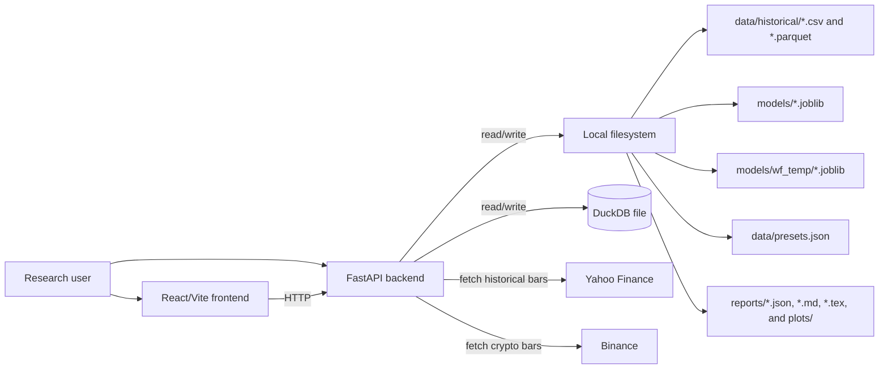
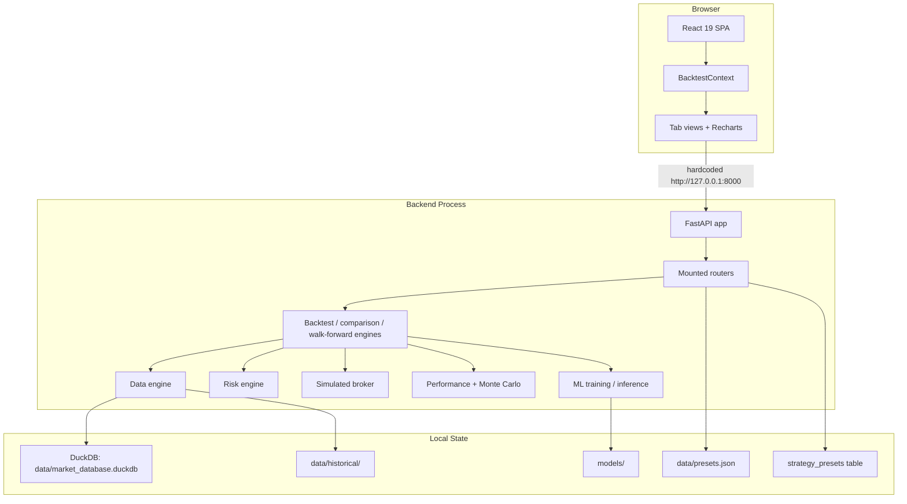
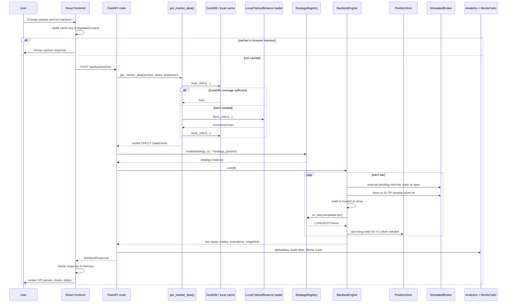
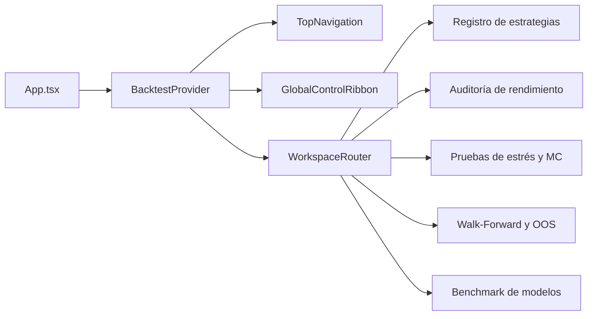

# ASTRA Technical Architecture

This document describes the current technical architecture of ASTRA as implemented in the repository today. It is intended for a project evaluator and for future maintainers who need to understand what is actually running, what is only partially wired, and where the main architectural risks are.

For product-level context, see [README.md](../README.md). For methodological intent around look-ahead control and evaluation metrics, see [methodology.md](./methodology.md).

## Reading guide

- Current behavior: code paths that are mounted, imported, and reachable in the default backend and frontend runtime.
- Intended or experimental behavior: implemented components that are not mounted, not consumed by the frontend, partially inconsistent, or effectively dormant.

## 1. Purpose and scope

ASTRA is a local quantitative research and backtesting platform. Its core responsibilities are:

1. Load OHLCV market data from local files, DuckDB, Yahoo Finance, or Binance.
2. Execute event-driven historical backtests with next-bar order semantics.
3. Apply volatility-based position sizing and simple execution-friction modeling.
4. Compute performance, benchmark-relative, and Monte Carlo statistics.
5. Train and load machine-learning models for a triple-barrier-based inference strategy.
6. Expose research workflows through FastAPI and render them in a React single-page application.

The system is not a live trading stack. There is no live broker connectivity, no background job queue, no authentication layer, no message broker, and no deployment orchestration defined in the repository.

## 2. System context

### 2.1 External dependencies and local artifacts

### 2.2 Runtime topology

Current runtime is a single-process backend plus a browser-hosted SPA. All persistence is file-based.

## 3. Request-to-result sequence

The primary live workflow is the frontend requesting a backtest through `POST /api/backtest/run`.

## 4. Backend layers and module ownership

| Layer | Primary modules | Current responsibility | Notes |
| --- | --- | --- | --- |
| API surface | `src/api/main.py`, `src/api/routers/*`, `src/api/schemas/*` | Mount FastAPI, validate request/response payloads, orchestrate engines, and serve compiled React frontend distribution (`frontend/dist`) via SPA fallback. | Only one FastAPI app is mounted. Serves both REST API and compiled SPA assets in a unified process when static distribution exists. |
| Domain primitives | `src/core/constants.py`, `src/core/events.py`, `src/core/models.py` | Shared event types, enums, position/trade structures | Stable foundation for event-driven flows. |
| Strategies | `src/strategies/*` | Generate bar-based trading signals and expose metadata | Discovery uses decorator-based registry population on import. |
| Data engine | `src/data_engine/*` | Load, normalize, cache, and persist OHLCV data and presets | Data and preset persistence are split across DuckDB and JSON. |
| Backtesting engines | `src/backtester/event_engine.py`, `comparator.py`, `walk_forward.py` | Simulate one strategy, compare two strategies, or run rolling validation | `comparator.py` and `walk_forward.py` depend on an API router helper, which is an inversion of normal layering. |
| Risk | `src/risk_engine/position_sizing.py` | Convert a LONG signal into quantity, stop-loss, and take-profit | Long-only sizing is explicit. |
| Execution | `src/execution_engine/simulated_broker.py` | Apply fixed and bps commission plus adverse slippage | No order book, latency, partial fills, or shorting model. |
| Analytics | `src/analytics/metrics.py`, `monte_carlo.py` | Compute CAGR, Sharpe, Sortino, alpha/beta, trade stats, and bootstrap risk | Return annualization is normalized to daily closes. |
| Machine learning | `src/ml_engine/*`, `src/strategies/ml_strategy.py` | Build features, label data, train models, load artifacts, run inference | Training route currently contains a verified interface mismatch. |
| Scripts and reports | `scripts/*`, `reports/*` | Offline data loading, benchmark generation, plotting, CLI workflows | Important for research output, but not mounted in the web runtime. |

## 5. Event-driven backtest lifecycle

### 5.1 Lifecycle stages

Current backtests are driven by a chronological loop over a pandas DataFrame of OHLCV bars.

1. Data is sorted by timestamp and ATR is computed if missing.
2. Each bar is processed in order.
3. Any pending order is executed at the current bar open.
4. Active positions are checked against intrabar stop-loss and take-profit thresholds.
5. Portfolio state is marked to market at the current close.
6. The strategy receives the fully closed bar via `on_bar`.
7. Any resulting signal is translated into an order for the next bar.
8. After the loop, performance and trade statistics are computed from accumulated state.

### 5.2 Next-bar semantics

Current behavior is explicitly next-bar, not same-bar execution for newly generated discretionary signals.

1. Strategy evaluation happens after close-based mark-to-market on bar `t`.
2. A generated LONG or EXIT becomes `pending_order`.
3. `pending_order` is executed at the open of bar `t + 1`.

This is the main anti-look-ahead control in the runtime path described in [methodology.md](./methodology.md).

### 5.3 Important same-bar consequence

Once a pending entry is filled at the next bar open, the engine immediately evaluates intrabar stop-loss and take-profit conditions against that same bar's high and low. That means an order can:

1. Be generated from bar `t`.
2. Fill at bar `t + 1` open.
3. Exit by stop-loss or take-profit within the same bar `t + 1`.

This is realistic for stop/target evaluation at bar granularity, but it compresses all intrabar path uncertainty into a single OHLC bar.

### 5.4 Position model

Current behavior is effectively single-position and long-only per symbol in the live path.

- Position state is stored per symbol, but mounted workflows operate on one requested symbol at a time.
- LONG signals are sized through the risk engine.
- EXIT signals and SL/TP exits close the full position.
- There is no short-selling path in mounted routes.
- There is no portfolio of multiple concurrent symbols in one request.

## 6. Data engine and persistence

### 6.1 Provider precedence

Current provider precedence in `UnifiedDataLoader` is:

1. Local file loader first.
2. Binance second, but only when the symbol is classified as crypto.
3. Yahoo Finance last.

The local source is treated as authoritative when it returns at least 50 bars. This is explicitly meant to prefer curated local datasets such as `SPY_4h.csv`.

### 6.2 Local normalization

Current local-file normalization behavior:

- Accepts CSV or Parquet under `data/historical/`.
- Resolves filenames using cleaned symbol variants such as `BTC_USD_4h.csv`.
- Normalizes column names to lowercase.
- Maps aliases such as `date`, `datetime`, `time` to `timestamp` and `vol` to `volume`.
- Parses timestamps as UTC.
- Rewrites `symbol` to the requested symbol regardless of source filename contents.

### 6.3 Yahoo Finance 4h resampling

Current Yahoo 4h behavior is a derived timeframe, not a native provider interval.

1. A requested `4h` series is fetched from Yahoo as `1h` data.
2. The loader resamples the result into 4-hour buckets using first open, max high, min low, last close, and summed volume.
3. Yahoo intraday retention limits are enforced by truncating the requested start date to the provider's supported lookback window.

Implication: a `4h` equity backtest on Yahoo data is only as exact as the resampled hourly feed and the chosen resample boundaries.

### 6.4 Backend market-data cache

Current backend caching is in-process and memory-only.

- Module-level cache: `_DATA_CACHE` in `src/api/routers/simulation.py`.
- Key: `(symbol, start_date, end_date, timeframe)`.
- Scope: one Python process.
- Invalidated: only by process restart.

This cache is not shared across workers and is not persisted.

### 6.5 DuckDB schemas

Current persistent database file is `data/market_database.duckdb`.

#### `ohlcv`

| Column | Type | Notes |
| --- | --- | --- |
| `timestamp` | `TIMESTAMP` | Part of primary key |
| `symbol` | `VARCHAR` | Part of primary key |
| `timeframe` | `VARCHAR` | Part of primary key, default `1d` |
| `open` | `DOUBLE` | OHLCV field |
| `high` | `DOUBLE` | OHLCV field |
| `low` | `DOUBLE` | OHLCV field |
| `close` | `DOUBLE` | OHLCV field |
| `volume` | `DOUBLE` | OHLCV field |

Primary key: `(timestamp, symbol, timeframe)`.

#### `strategy_presets`

| Column | Type | Notes |
| --- | --- | --- |
| `preset_name` | `VARCHAR` | Primary key |
| `strategy_id` | `VARCHAR` | Registered strategy identifier |
| `timeframe` | `VARCHAR` | Default `1d` |
| `strategy_params` | `VARCHAR` | JSON string |
| `risk_fraction` | `DOUBLE` | Execution/risk setting |
| `atr_multiplier_sl` | `DOUBLE` | Execution/risk setting |
| `atr_multiplier_tp` | `DOUBLE` | Execution/risk setting |
| `commission_bps` | `DOUBLE` | Friction setting |
| `commission_fixed` | `DOUBLE` | Friction setting |
| `slippage_bps` | `DOUBLE` | Friction setting |
| `gap_slippage_enabled` | `BOOLEAN` | Gap stop-loss behavior |
| `description` | `VARCHAR` | Human-readable note |
| `created_at` | `TIMESTAMP` | Default current timestamp |
| `updated_at` | `TIMESTAMP` | Updated on write |

### 6.6 File-based artifacts

Current file artifacts include:

| Artifact | Path pattern | Producer | Consumer |
| --- | --- | --- | --- |
| Historical local bars | `data/historical/*.csv` or `*.parquet` | Manual import or scripts | `LocalFileLoader` |
| Primary database | `data/market_database.duckdb` | API routes and scripts | Data engine, presets API |
| JSON preset store | `data/presets.json` | `/api/backtest/presets` family | Frontend preset workflow |
| Trained ML models | `models/*_model.joblib` | ML training | `MLInferenceStrategy`, `/ml/models` |
| Walk-forward temp models | `models/wf_temp/*_model.joblib` | Walk-forward engine | Walk-forward ML windows |
| Benchmark summaries | `reports/*.json`, `*.md`, `*.tex` | Benchmark scripts | Humans only; frontend does not load them |
| Benchmark plots | `reports/plots/*` | Reporting scripts | Humans only |

## 7. Strategy registry and strategy ownership

Current strategy discovery is import-time registration via `@StrategyRegistry.register`. The mounted API exposes metadata from the registry rather than a hardcoded catalog.

| Strategy ID | Display name | Implementation role |
| --- | --- | --- |
| `trend_following_ema` | `EMA Trend Following` | Trend-following baseline |
| `regime_volatility_breakout` | `Regime-Filtered Volatility Breakout` | Volatility breakout with regime and volume filters |
| `statistical_mean_reversion` | `Statistical Z-Score Mean Reversion` | Mean-reversion model |
| `ml_inference` | `ML Triple-Barrier Inference` | Artifact-backed ML signal generation |
| `custom_rule_strategy` | `Custom Rule-Based Constructor` | User-configurable indicator-rule strategy |

Current behavior:

- Metadata is derived from each strategy class through `get_metadata()`.
- Construction is dynamic through `StrategyRegistry.create(strategy_id, **kwargs)`.
- An unknown strategy ID raises a `KeyError` and becomes an HTTP 400 in mounted routes.

## 8. Risk and execution model

### 8.1 Risk engine

Current position sizing uses ATR-scaled volatility sizing.

1. Risk capital is `current_equity * risk_fraction`.
2. Stop distance is `ATR * atr_multiplier_sl`.
3. Quantity target is `risk_capital / stop_distance`.
4. Quantity is capped by a 2% cash buffer through `(equity * 0.98) / current_price`.
5. Stop-loss and take-profit are derived from ATR multiples at signal time.

### 8.2 Execution engine

Current broker simulation is deliberately simple.

- Buy orders receive adverse slippage upward.
- Sell orders receive adverse slippage downward.
- Commission combines a fixed amount and a bps notional fee.
- Fills are always complete.
- There is no latency model, queue priority, spread model, borrow cost, or partial-fill behavior.

### 8.3 Gap semantics

Current stop-loss handling has explicit next-open gap logic.

- If the next-bar open is below a long stop and `gap_slippage_enabled` is true, the exit uses the open, not the stop price.
- Take-profit exits use `max(take_profit, open)` for long positions.

## 9. Analytics and Monte Carlo

### 9.1 Performance metrics

Current analytics are derived from the realized equity curve and trade list.

- CAGR, Sharpe, Sortino, max drawdown.
- Trade win rate, profit factor, payoff ratio, expectancy, duration, streaks.
- Alpha and beta relative to a buy-and-hold benchmark built from the same requested market data.
- Calmar ratio in the backtest route.

Important implementation detail: Sharpe, Sortino, and alpha/beta first convert any intraday equity curve into a daily close series. This standardizes return frequency but smooths intraday path detail.

### 9.2 Monte Carlo

Current Monte Carlo is bootstrap resampling over realized completed trades, not over bar returns.

1. Extract realized trade PnL and PnL%.
2. Sample completed trades with replacement.
3. Build simulated equity paths from the trade sequence.
4. Compute drawdown percentiles, risk of ruin, VaR, CVaR, and confidence bands.

This design is useful for sensitivity analysis on the observed strategy distribution, but it does not model market-state transitions or serial correlation beyond what is preserved in the empirical trade set.

## 10. Machine-learning training and inference lifecycle

### 10.1 Intended training pipeline

The implemented training pipeline is conceptually:

1. Normalize OHLCV data onto a timestamp index.
2. Build stationary technical features.
3. Estimate exponentially weighted input-bar volatility; it is daily only for `1d` input.
4. Use a CUSUM filter to choose event times.
5. Build vertical barriers.
6. Apply triple-barrier labeling.
7. Train a `HistGradientBoostingClassifier`.
8. Optionally optimize hyperparameters with Optuna-based search helpers.
9. Save a `joblib` artifact containing model, feature names, config, and metrics.

### 10.2 Current inference lifecycle

Current mounted inference behavior lives in `MLInferenceStrategy`.

1. Buffer incoming bars in memory.
2. Wait for `lookback_window` bars.
3. Lazily load a model artifact from disk if not already loaded.
4. Rebuild the same feature schema from buffered bars.
5. Align current features to the stored `feature_names`.
6. Generate `predict_proba` output.
7. Emit `LONG` above `threshold_long`.
8. Emit `EXIT` below `threshold_exit`.

### 10.3 Current ML route status

Current mounted route family exists at `/ml`, but `POST /ml/train` is not operational as written.

- Verified issue: the route calls `StorageManager.load_bars(...)`.
- Current `StorageManager` implementation only exposes `load_ohlcv(...)`.
- Result: training requests should fail with an attribute error before model training starts.

### 10.4 Artifact trust model

Current model discovery route `GET /ml/models` loads every `.joblib` artifact it finds in `models/` to read metadata. This means arbitrary code execution risk exists if untrusted `joblib` files are present in that directory.

## 11. Walk-forward and comparison engines

### 11.1 Walk-forward engine

Current walk-forward engine supports expanding-window evaluation and special handling for `ml_inference`.

1. Load full market data through the shared market-data helper.
2. Build rolling windows from an initial training period and a test step size.
3. For non-ML strategies, warm strategy state with a lookback buffer.
4. For `ml_inference`, train or reuse a window-specific model under `models/wf_temp/`.
5. Carry forward capital, positions, and pending orders between windows.
6. Concatenate out-of-sample equity across all windows.
7. Compute OOS Sharpe and WFER.

Current classification thresholds:

- `ROBUST` when Sharpe >= 0.8 and WFER >= 0.50.
- `MODERATE` when Sharpe >= 0.3 and WFER >= 0.25.
- Otherwise `OVERFITTED`.

### 11.2 Walk-forward route versus frontend reality

Current backend route `POST /walk-forward` exists, but the current frontend validation tab does not call it.

Instead, the frontend:

1. Splits the most recent backtest equity curve client-side into IS/OOS partitions.
2. Recomputes Sharpe-like metrics in the browser.
3. Displays a static academic benchmark matrix from hardcoded data.

This means the UI label `Walk-Forward y OOS` mixes two different concepts:

- Current live behavior: client-side OOS split on a single backtest result.
- Current static behavior: hardcoded benchmark reference values.
- Intended or experimental behavior: server-driven rolling walk-forward validation.

### 11.3 Walk-forward response filtering and friction mismatch

Current walk-forward engine returns more data than the public route schema exposes, including:

- `gross_return_pct`
- `total_commissions_usd`
- `total_slippage_usd`
- `total_friction_pct`
- `cost_drag_pct`
- `trades`

Because the route declares `response_model=WalkForwardResponse`, FastAPI filters those fields out of the response. The engine computes friction-aware outputs, but clients calling the mounted route do not receive them.

### 11.4 Comparison engines

There are currently two comparison implementations:

1. `src/backtester/comparator.py`, exposed by `POST /compare`.
2. An in-router comparison implementation inside `src/api/routers/simulation.py`, exposed by `POST /api/backtest/compare`.

Both compare two strategies under the same market conditions and output per-strategy metrics plus an equity timeline, but they are separate code paths with overlapping responsibilities.

## 12. API surface

### 12.1 Mounted FastAPI routes

The current application mounts only the composite router imported in `src/api/main.py`.

Default FastAPI documentation endpoints are available because they are not disabled:

- `GET /docs`
- `GET /redoc`
- `GET /openapi.json`

#### Strategy and preset routes mounted at root

| Method | Path | Source module | Current purpose | Notes |
| --- | --- | --- | --- | --- |
| `GET` | `/strategies` | `src/api/routers/strategies.py` | List registered strategies via schema-backed metadata | Uses `StrategyRegistry.list_strategies()` |
| `GET` | `/presets` | `src/api/routers/strategies.py` | List strategy presets from DuckDB | Not used by current frontend |
| `POST` | `/presets` | `src/api/routers/strategies.py` | Save/update strategy preset in DuckDB | Not used by current frontend |
| `DELETE` | `/presets/{preset_name}` | `src/api/routers/strategies.py` | Delete strategy preset from DuckDB | Not used by current frontend |

#### Validation and standalone comparison routes mounted at root

| Method | Path | Source module | Current purpose | Notes |
| --- | --- | --- | --- | --- |
| `POST` | `/walk-forward` | `src/api/routers/validation.py` | Run expanding rolling walk-forward validation | Mounted, but not consumed by current frontend |
| `POST` | `/compare` | `src/api/routers/comparison.py` | Compare two strategies through `ComparatorEngine` | Mounted, but current frontend uses the duplicate `/api/backtest/compare` route instead |

#### Machine-learning routes mounted under `/ml`

| Method | Path | Source module | Current purpose | Notes |
| --- | --- | --- | --- | --- |
| `POST` | `/ml/train` | `src/api/routers/ml_router.py` | Train and persist an ML model | Currently broken by `load_bars` mismatch |
| `GET` | `/ml/models` | `src/api/routers/ml_router.py` | List readable model artifacts | Loads every `.joblib` file on disk |

#### Simulation and comparison routes mounted under `/api/backtest`

| Method | Path | Source module | Current purpose | Notes |
| --- | --- | --- | --- | --- |
| `GET` | `/api/backtest/strategies` | `src/api/routers/simulation.py` | List registered strategy metadata | This is the route family used by the frontend |
| `GET` | `/api/backtest/presets` | `src/api/routers/simulation.py` | List presets from `data/presets.json` | Duplicates root `/presets` but uses a different store |
| `POST` | `/api/backtest/presets` | `src/api/routers/simulation.py` | Save preset to `data/presets.json` | Frontend uses this route |
| `DELETE` | `/api/backtest/presets/{preset_name}` | `src/api/routers/simulation.py` | Delete preset from `data/presets.json` | Frontend uses this route |
| `POST` | `/api/backtest/run` | `src/api/routers/simulation.py` | Execute one backtest and compute analytics | Primary live workflow |
| `POST` | `/api/backtest/compare` | `src/api/routers/simulation.py` | Compare two strategies | Duplicate of root `/compare` in a different implementation |
| `POST` | `/api/backtest/oos-audit` | `src/api/routers/simulation.py` | Compute IS/OOS split metrics from an existing equity curve | Mounted, but current frontend computes similar logic client-side |

### 12.2 Unmounted routers and missing schema issue

The repository contains routers that are not currently included in the main app:

| Router module | Declared route | Current status | Issue |
| --- | --- | --- | --- |
| `src/api/routers/data_router.py` | `POST /fetch` | Unmounted | Imports `src.api.schemas.market.MarketDataQuery`, but `src/api/schemas/market.py` does not exist in the repository |
| `src/api/routers/ws_router.py` | `WS /backtest` | Unmounted | Implemented heartbeat socket, but never included in `src/api/main.py` |

Important nuance: `data_router.py` returns a placeholder `{status: "queued"}` response, but there is no actual queue implementation in the repository.

## 13. Duplicate route families and duplicate preset stores

Current architecture contains overlapping API surfaces.

### 13.1 Duplicate preset route families

- Root family: `/presets` backed by DuckDB `strategy_presets`.
- Simulation family: `/api/backtest/presets` backed by `data/presets.json`.

Current frontend behavior uses only `/api/backtest/presets`, so user-visible presets live in JSON, not in the database-backed preset table.

### 13.2 Duplicate comparison route families

- Root family: `POST /compare` via `ComparatorEngine`.
- Simulation family: `POST /api/backtest/compare` via in-router implementation.

These are conceptually redundant and increase maintenance cost because behavior can drift independently.

## 14. Frontend architecture

### 14.1 High-level structure

Current frontend is a React 19 + Vite SPA with one global context and multiple tabbed views.

### 14.2 Current tab views and labels

The current UI labels are manually authored in Spanish:

| Tab key | Current label | Purpose |
| --- | --- | --- |
| `studio` | `Registro de estrategias` | Strategy catalog, presets, custom builder, friction controls |
| `performance` | `Auditoría de rendimiento` | Main KPI panels, equity charts, benchmark overlays, trade tables |
| `stress_testing` | `Pruebas de estrés y MC` | Monte Carlo outputs from the most recent backtest |
| `validation` | `Walk-Forward y OOS` | Client-side OOS split plus hardcoded academic benchmark matrix |
| `comparison` | `Benchmark de modelos` | Two-strategy comparison against buy-and-hold |

### 14.3 Shared controls

Current shared controls are centralized in `GlobalControlRibbon`:

- Asset picker modal.
- Initial capital input.
- Quick date-range chips.
- Start and end date inputs.
- Run-backtest button.

These controls update the global `BacktestContext` and primarily drive the `POST /api/backtest/run` workflow.

### 14.4 State and cache model

Current frontend state is intentionally simple and entirely client-side.

- Global state holder: `BacktestContext`.
- Result cache: `resultsCache` as `useRef(Map<string, BacktestResult>)`.
- Cache key includes market, timeframe, strategy, risk, friction, Monte Carlo, and `strategy_params`.
- Metadata requests load strategies and presets, then auto-run only the first backtest. Because the metadata callback depends on the parameter-bound `runSimulation` callback, parameter changes currently trigger additional metadata requests.
- `reloadPresets` invokes that same metadata request explicitly after preset mutations.
- No persistence to `localStorage`, IndexedDB, or server session state.

### 14.5 Data fetching reality

Current frontend API behavior is hardcoded.

- Base URLs are literal `http://127.0.0.1:8000/...` strings.
- No environment-based API host selection is used.
- No shared API client abstraction exists.

### 14.6 Charting and localization

Current visualization stack uses Recharts and custom formatter helpers.

- Candlestick and line compositions for performance view.
- Overlay comparison chart for strategy comparison.
- Scatter and composed charts in validation view.
- Spanish copy is manually embedded in components, not provided by an i18n framework.

### 14.7 Current frontend inconsistencies

| Issue | Current behavior | Impact |
| --- | --- | --- |
| Hardcoded backend URL | Requests always target `http://127.0.0.1:8000` | Breaks environment portability |
| Metadata effect depends on parameters | Changing any `params` value recreates `runSimulation`, then `loadMetadata`, and reruns the metadata effect | Strategy and preset endpoints are queried more often than intended |
| Main stale detector is partial | It watches symbol, timeframe, dates, strategy, capital, and strategy parameters, but not sizing, friction, or Monte Carlo controls | Results can appear current after untracked controls change |
| Comparison timeframe omission | Comparison payload does not send `timeframe` | Backend falls back to default request timeframe, so UI timeframe choice is not represented in the request |
| Stale comparison detector is partial | It watches model selectors, symbol, and dates, but not timeframe, capital, sizing, or friction | UI can appear up to date when an untracked comparison input changes |
| Validation tab not API-backed | Uses active backtest split and static benchmark data | Name suggests true walk-forward, but current live logic is different |
| Static academic benchmark data | Benchmark matrix is hardcoded in the component | Reports on disk are not the source of truth for the UI |

## 15. Configuration reality

### 15.1 Active configuration

Current runtime configuration is mostly implicit and path-relative.

- `StorageManager()` defaults to `data/market_database.duckdb`.
- Simulation presets default to `data/presets.json`.
- Model artifacts default to `models/`.
- `MLInferenceStrategy` defaults to `models/BTC_USD_4h_model.joblib`.

### 15.2 Dormant `Settings`

The repository contains `src/core/config.py` with a `Settings` class and base paths, but mounted runtime flows do not consistently use it. One notable script (`scripts/data/fetch_initial_data.py`) uses `settings.duckdb_path`, while the API and most engines instantiate relative paths directly.

### 15.3 Dormant YAML configuration

Files under `config/` exist:

- `default_config.yaml`
- `logging_config.yaml`
- `strategies_config.yaml`

Current code search shows no mounted runtime path that loads these YAML files. They should be treated as dormant or future-facing configuration assets, not as active application configuration.

## 16. Major design decisions and tradeoffs

### 16.1 Local-first, file-based persistence

Decision: keep all core artifacts in local files and a single DuckDB database.

Tradeoff: very low operational complexity, but poor multi-user coordination, limited horizontal scalability, and easy duplication of truth.

### 16.2 Event-driven, next-bar simulation

Decision: process completed bars and execute resulting signals on the next bar.

Tradeoff: strong protection against obvious look-ahead bias at daily or intraday bar granularity, but still a simplified model of intrabar path dependence.

### 16.3 Registry-driven strategy discovery

Decision: allow strategies to self-register and expose metadata.

Tradeoff: flexible UI/API discovery, but import-time side effects mean registration depends on module import coverage.

### 16.4 Shared pandas-based data path

Decision: standardize loaders and engines on pandas DataFrames.

Tradeoff: straightforward research ergonomics, but less memory-efficient than a stricter columnar-only design and not tuned for very large universes.

### 16.5 Server-side analytics with client-side presentation

Decision: return fully shaped chart-ready responses for the main backtest route.

Tradeoff: easy frontend rendering, but larger payloads and duplicated formatting logic across route families.

## 17. Extension guides

### 17.1 Add a new strategy

1. Create a new strategy class under `src/strategies/` inheriting from `BaseStrategy`.
2. Define stable `id`, `name`, `description`, `category`, and `get_metadata()`.
3. Decorate the class with `@StrategyRegistry.register`.
4. Export or import the module from `src/strategies/__init__.py` so registration happens.
5. Ensure `on_bar()` emits current signal types expected by the engines.
6. Verify it appears in `GET /strategies` and `GET /api/backtest/strategies`.

### 17.2 Add a new backend endpoint

1. Decide whether the endpoint belongs in an existing mounted router or a new router.
2. Prefer placing domain logic in a service or engine, not in the router function.
3. Add request and response schemas under `src/api/schemas/`.
4. Mount the router from `src/api/routers/__init__.py` and ensure `src/api/main.py` includes it through the composite router.
5. Avoid introducing new duplicate route families when an existing one already covers the capability.

### 17.3 Add a new frontend view

1. Create a component under `frontend/src/components/views/`.
2. Extend the `WorkspaceTab` union in the frontend types and context.
3. Add a navigation entry in `TopNavigation.tsx`.
4. Render the new view in `App.tsx` through `WorkspaceRouter`.
5. Reuse `BacktestContext` only if the view genuinely depends on global backtest state; otherwise prefer a dedicated local data flow.

## 18. Deployment, security, and scaling constraints

### 18.1 Deployment constraints

Current repository reality supports local or simple single-instance deployment only.

- **Single-service deployment:** `src/api/main.py` resolves and mounts `frontend/dist` dynamically when present, enabling unified single-port web hosting (e.g., Render Web Services) alongside standard dual-server development (`npm run dev` + `uvicorn`).
- Relative file paths assume a writable working directory.
- In-memory caches are process-local.
- Generated models and presets are stored on local disk.
- No shared object storage or database service is configured.

### 18.2 Security constraints

Current security posture is intentionally minimal and not production-safe.

- CORS is fully permissive: `allow_origins=["*"]`, all methods, all headers.
- No authentication or authorization is implemented.
- Model artifacts are loaded with `joblib`, which is unsafe for untrusted files.
- Preset and model paths are filesystem-relative.

### 18.3 Scaling constraints

Current architecture does not scale cleanly across multiple backend workers.

- `_DATA_CACHE` is in-memory and per-process.
- File-backed preset writes are not coordinated.
- Duplicate stores increase synchronization risk.
- Large chart-ready responses make each request relatively heavy.

## 19. Known technical debt and inconsistencies

The following issues are verified from the current codebase and are the highest-value architectural cleanup targets.

| Area | Current issue | Why it matters |
| --- | --- | --- |
| ML training route | `POST /ml/train` calls missing `StorageManager.load_bars()` | Mounted feature is currently broken |
| Walk-forward response contract | Engine computes friction and trade details that `WalkForwardResponse` drops | Important validation detail is silently lost |
| Walk-forward frontend mismatch | Validation tab does not call `/walk-forward` | UI label overstates what is actually happening |
| Domain-to-router dependency inversion | `ComparatorEngine` and `WalkForwardEngine` import `get_market_data()` from an API router module | Couples domain logic to transport layer |
| Duplicate preset stores | DuckDB presets and JSON presets coexist | Two sources of truth |
| Duplicate comparison routes | `/compare` and `/api/backtest/compare` overlap | Behavior drift risk |
| Hardcoded frontend API URL | Literal `http://127.0.0.1:8000` appears in components/context | No environment portability |
| Comparison timeframe omission | Frontend comparison payload does not send `timeframe` | Comparison may ignore the currently selected timeframe |
| Static benchmark data | Validation matrix is hardcoded in the client | Not synchronized with `reports/` artifacts |
| Missing market schema | `data_router.py` depends on `src/api/schemas/market.py`, which does not exist | Router cannot be safely mounted |
| Unmounted WebSocket router | `ws_router.py` exists but is not included | Capability is incomplete and unused |
| Permissive CORS / no auth | Entire API is open to any origin | Unsuitable for exposed deployment |
| Untrusted `joblib` loading | Model listing and inference trust local artifact contents | Security risk |

## 20. Summary

ASTRA's current architecture is strongest as a local research platform built around a clear event-driven backtest loop, lightweight file-based persistence, and an accessible React UI for single-symbol strategy analysis. The most important architectural mismatches are not in the core backtest engine, but in duplicated API surfaces, divergent preset storage, partially wired ML and walk-forward workflows, and transport-layer concerns leaking into domain engines.

For maintainers, the safest reading is:

1. The primary source of truth for live behavior is `POST /api/backtest/run` plus the React context and performance views.
2. Walk-forward, ML training, and unmounted routers should be treated as partially integrated capabilities rather than fully finished product surfaces.
3. Consolidating route families, persistence choices, and configuration ownership will likely yield more value than adding new features on top of the current duplication.
