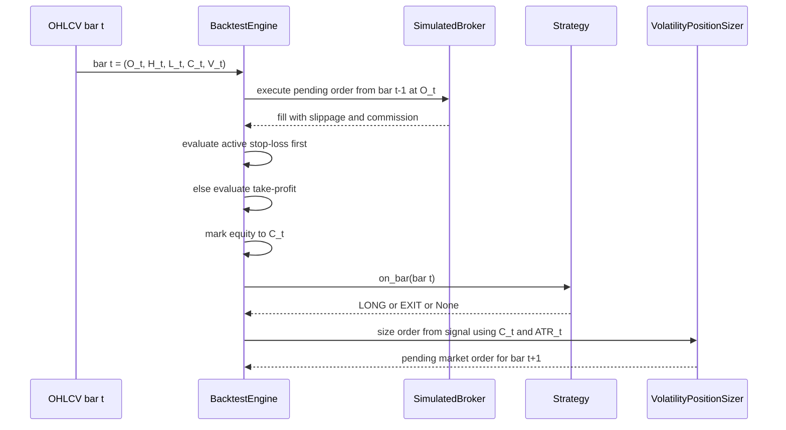

# Quantitative Methodology

This document describes the quantitative methodology implemented in the current ASTRA codebase. It is written for evaluators who need to understand what the system does, what it does not do, and how reported results are produced. For a project overview, see [README](../README.md). For component boundaries, see [Architecture](./architecture.md).

## 1. Research Objective, Scope, and Non-Claims

### Objective

ASTRA is an offline research and evaluation environment for comparing systematic long-only trading strategies under a single event-driven simulation framework. The implemented workflow covers:

- historical OHLCV ingestion,
- rule-based and ML-based signal generation,
- volatility-based position sizing,
- friction-aware execution simulation,
- benchmark-relative analytics,
- Monte Carlo stress testing, and
- expanding-window walk-forward evaluation.

### Scope

The current implementation supports:

- single-asset backtests over one OHLCV stream at a time,
- long entry and flat exit decisions only,
- market-order execution at the next bar open,
- ATR-derived stop-loss and take-profit brackets,
- Buy & Hold comparison,
- bootstrap resampling of realized trades, and
- optional ML model training and inference based on triple-barrier labels.

### Non-Claims

The current implementation does not claim:

- statistical significance,
- live trading readiness,
- execution realism beyond the stated friction model,
- portfolio-level multi-asset allocation,
- short selling support,
- liquidity-aware or market-impact-aware fills,
- corporate-action-adjusted total-return benchmarking, or
- production-grade ML model serving.

Any interpretation should therefore be limited to controlled research evaluation under the assumptions stated below.

## 2. Conventions and Notation

### 2.1 Percentage vs decimal convention

ASTRA mixes decimal and percentage representations internally and at the API layer.

- A decimal return is written as $r = 0.05$ for $5\%$.
- A percentage is written as $R_{\%} = 5.0$ for $5\%$.
- Strategy equity is always expressed in account currency units.
- Trade PnL is expressed in account currency units.
- Trade `pnl_pct` is reported in percentage units, not decimal units.

### 2.2 Notation table

| Symbol | Meaning | Unit |
| --- | --- | --- |
| $t$ | Bar index in chronological order | bars |
| $O_t, H_t, L_t, C_t, V_t$ | Open, high, low, close, volume of bar $t$ | price, volume |
| $E_t$ | Portfolio equity at time $t$ | currency |
| $C_t^{cash}$ | Uninvested cash at time $t$ | currency |
| $Q_t$ | Position quantity | asset units |
| $A_t$ | Average True Range used by the sizer | price |
| $f_r$ | Risk fraction per trade | decimal |
| $m_{SL}$ | ATR stop-loss multiplier | ATR multiples |
| $m_{TP}$ | ATR take-profit multiplier | ATR multiples |
| $P_t^{sig}$ | Signal-bar close used to derive brackets | price |
| $P_{t+1}^{open}$ | Next-bar open used for execution | price |
| $c_{bps}$ | Variable commission rate | basis points |
| $s_{bps}$ | Slippage rate | basis points |
| $r_d$ | Daily return after UTC resampling | decimal |
| $r_{f,d}$ | Daily risk-free rate | decimal |
| $\beta$ | Benchmark beta from daily returns covariance | unitless |
| $\alpha$ | Annualized benchmark-relative alpha | decimal before API scaling |

## 3. Data Sources, Precedence, and Coverage Rules

### 3.1 Loader precedence

Market data retrieval follows two layers of precedence.

#### Layer 1: in-process cache and DuckDB storage

For a request $(symbol, start, end, timeframe)$, the simulation path first checks:

1. an in-memory cache keyed by the full request tuple,
2. local DuckDB storage in `data/market_database.duckdb`,
3. an external loader only if storage coverage is judged insufficient.

Stored data is considered sufficient when all of the following hold:

- the loaded dataset is non-empty,
- it contains at least 30 rows,
- its earliest timestamp is no later than `start + 7 days`, and
- its latest timestamp is no earlier than `end - 4 days`.

If those coverage checks fail, ASTRA fetches fresh data from the unified loader and attempts to persist it back to DuckDB.

#### Layer 2: unified external loader precedence

The unified loader applies the following source order:

1. local files in `data/historical`,
2. Binance for assets classified as crypto,
3. Yahoo Finance as the final fallback.

Local or Binance data is accepted only when at least 50 rows are available; otherwise the pipeline falls through to the next source.

### 3.2 Source-specific behavior

| Source | When used | Notes |
| --- | --- | --- |
| Local file loader | Always checked first | Looks for CSV or Parquet files under `data/historical` using multiple symbol filename patterns. |
| Binance loader | Used after local data for crypto-like symbols | Maps symbols such as `BTC-USD` to `BTCUSDT`. Supports `1d`, `4h`, `1h`, `15m`, `5m`, `1m`. |
| Yahoo Finance loader | Fallback for non-crypto or insufficient earlier sources | Uses `auto_adjust=False`; therefore prices are not transformed into dividend-adjusted total-return series. |

### 3.3 OHLCV normalization

All loaders normalize market data to the schema:

| Field | Meaning |
| --- | --- |
| `timestamp` | UTC timestamp |
| `symbol` | Requested symbol string |
| `open`, `high`, `low`, `close` | Floating-point prices |
| `volume` | Floating-point traded volume |

Additional normalization details:

- Local files lowercase and trim column names.
- Local files rename aliases such as `date`, `datetime`, or `time` to `timestamp`, and `vol` to `volume`.
- Data is sorted chronologically before simulation.
- DuckDB stores timestamps as timezone-naive UTC-normalized values and reloads them back as UTC-aware pandas timestamps.
- When the requested end date is midnight, storage expands it to the end of that UTC day.

### 3.4 Time handling and resampling

- Simulation itself uses the bar timestamps returned by the loaders after UTC normalization.
- Performance analytics convert any equity curve to a UTC daily close series via `.resample("1D").last().ffill()` before Sharpe, Sortino, alpha, and beta are computed.
- Yahoo Finance `4h` data is not downloaded directly. The loader fetches `1h` bars and resamples them to `4h` using:

	- open = first,
	- high = max,
	- low = min,
	- close = last,
	- volume = sum.

- Yahoo Finance constrains intraday history:

	- `15m` and `5m` requests are clipped to the last 58 days,
	- `1h` and `4h` requests are clipped to the last 720 days.

### 3.5 Coverage and survivorship caveat

The system evaluates only the symbols requested and only the rows delivered by the chosen source. There is no point-in-time historical universe construction, no delisting reconstruction, and no survivorship-control layer. Evaluations should therefore be interpreted as single-instrument historical studies, not as unbiased universe-level evidence.

## 4. Event Chronology and Anti-Look-Ahead Safeguards

The backtester processes bars strictly in chronological order and separates signal generation from order execution.

### 4.1 Chronology per bar

For each completed bar $t$:

1. any pending order generated on bar $t-1$ is executed at the open of bar $t$,
2. any active bracket exits are evaluated intrabar on bar $t$,
3. the open position is marked to the close of bar $t$,
4. the strategy receives the completed bar $t$ and may emit a signal,
5. that signal is converted into a pending order for bar $t+1$.

This ordering prevents same-bar decision and fill at the same observed close.

### 4.2 Sequence diagram

### 4.3 Practical safeguards already in the implementation

- Pending entries are filled at the next bar open, never at the same close that generated the signal.
- Donchian breakout levels in the volatility-breakout strategy are computed from buffered historical bars before the current bar is appended.
- Walk-forward windows are chronological and expanding.
- ML training uses CUSUM event sampling, triple-barrier horizons, and PurgedKFold with embargo to reduce temporal leakage.

### 4.4 Remaining sources of bias

The implementation still contains simplifications that evaluators should treat as potential bias sources:

- stop-loss and take-profit decisions are made with bar-level high/low only, without full intrabar path reconstruction,
- the same bar can trigger both stop and target, in which case the stop is always given precedence,
- benchmark series do not include dividends or financing,
- no liquidity filter or market depth model is applied.

## 5. Execution, Position Sizing, and Risk Controls

### 5.1 Long-only constraint

The current execution engine supports long entry and flat exit only.

- A `LONG` signal becomes a buy market order.
- An `EXIT` signal becomes a sell market order only when a long position is already open.
- There is no short inventory, no borrow model, and no short-side PnL path.

### 5.2 Exact entry timing

If a strategy emits a long signal on bar $t$, the order is queued and executed at $P_{t+1}^{open}$ on the next available bar, subject to slippage and commission.

### 5.3 ATR-based quantity formula

Let:

- $E_t$ be current equity after mark-to-market at the signal bar close,
- $f_r$ be the configured risk fraction,
- $A_t$ be the current ATR,
- $m_{SL}$ be the stop-loss ATR multiplier,
- $C_t$ be the signal-bar close,
- $K_t$ be risk capital, and
- $D_t$ be stop distance.

Then ASTRA computes:

$$
K_t = E_t \cdot f_r
$$

$$
D_t = A_t \cdot m_{SL}
$$

$$
Q_t^{target} = \frac{E_t \cdot f_r}{A_t \cdot m_{SL}}
$$

### 5.4 2% affordability buffer

ASTRA also imposes a cash affordability cap that reserves 2% of current equity for execution costs:

$$
Q_t^{max} = \frac{0.98 \cdot E_t}{C_t}
$$

The final position size is:

$$
Q_t = \min\left(Q_t^{target}, Q_t^{max}\right)
$$

Orders are not created when ATR, price, or equity are non-positive, or when the final quantity is non-positive.

### 5.5 Bracket derivation

Brackets are derived from the signal-bar close, not from the eventual next-bar executed entry price.

For a long order generated on bar $t$:

$$
SL_t = C_t - m_{SL} \cdot A_t
$$

$$
TP_t = C_t + m_{TP} \cdot A_t
$$

These values are rounded to two decimals and attached to the pending order. Because the actual fill occurs at $O_{t+1}$, a gap between $C_t$ and $O_{t+1}$ can materially change realized ex-ante risk relative to the intended bracket geometry.

### 5.6 Strategy-emitted stop fields are overridden

`SignalEvent` supports `stop_loss` and `take_profit` fields, and the mean-reversion strategy currently emits a stop-loss value on entry. However, the global position sizer does not read those strategy-supplied stop values. It always rebuilds stop-loss and take-profit from current equity, signal-bar close, current ATR, and the globally configured ATR multipliers. In effect, strategy-level stop fields are replaced by the global sizer brackets.

### 5.7 Intrabar exit ordering

For an open long position on bar $t$:

1. stop-loss is checked first using `low <= stop_loss`,
2. take-profit is checked only if the stop condition did not trigger, using `high >= take_profit`.

If both the stop and target are reachable within the same bar range, the implementation always books the stop-loss outcome.

### 5.8 Gap handling and exact exit prices

For a long stop-loss:

- if `gap_slippage_enabled = True` and $O_t < SL$, the nominal exit price is $O_t$,
- otherwise the nominal exit price is $SL$.

For a long take-profit:

- the nominal exit price is $\max(TP, O_t)$.

The simulated broker then applies adverse slippage again to the nominal exit price.

### 5.9 Commission and slippage assumptions

The simulated broker applies:

- variable commission: `commission_bps / 10,000`,
- fixed commission: `commission_fixed`,
- adverse slippage: `slippage_bps / 10,000`.

For a buy:

$$
P^{fill}_{buy} = P^{nominal} \cdot (1 + s)
$$

For a sell:

$$
P^{fill}_{sell} = P^{nominal} \cdot (1 - s)
$$

where $s = \text{slippage bps} / 10{,}000$.

Variable commission is charged on filled notional:

$$
F = F_0 + P^{fill} \cdot Q \cdot c
$$

where $F$ is total commission, $F_0$ is fixed commission, and
$c = \text{commission bps} / 10{,}000$.

### 5.10 End-of-test positions

Positions are not force-liquidated at the final bar. Final equity includes the marked-to-close unrealized value of any active position, and the response also returns that active position separately. As a result:

- final equity can include unrealized gains or losses,
- trade counts exclude any still-open position,
- trade-based statistics exclude unrealized PnL on the active end position.

## 6. Implemented Strategies

The current codebase exposes five evaluator-relevant strategy families under the registry used by the backtester and API.

### 6.1 Strategy summary table

| Strategy | Registry id | Default parameters in implementation | Long entry logic | Exit logic | Notes |
| --- | --- | --- | --- | --- | --- |
| EMA Trend Following | `trend_following_ema` | `fast_ema=20`, `slow_ema=50`, `atr_period=14` | Fast online EMA crosses above slow online EMA | Fast online EMA crosses below slow online EMA | No short side. ATR period is stored but the strategy itself does not place brackets; the global sizer does. |
| Regime-Filtered Volatility Breakout | `regime_volatility_breakout` | `channel_period=20`, `adx_period=14`, `adx_threshold=25.0`, `volume_ma_period=20`, `volume_multiplier=1.2`, `atr_period=14` | Current close breaks above prior Donchian high, current volume is at least `volume_multiplier * volume_MA`, and current ADX is at least the threshold | Current close falls below the Donchian midpoint | Donchian boundaries are computed from completed historical bars before the current bar is appended. |
| Statistical Z-Score Mean Reversion | `statistical_mean_reversion` | `lookback_period=20`, `z_entry_threshold=-2.0`, `z_exit_threshold=0.0`, `rsi_period=2`, `rsi_entry_threshold=15.0`, `adx_period=14`, `adx_max_regime=22.0`, `atr_period=14`, `atr_sl_mult=2.0` | $z$-score is below the entry threshold, RSI is below the entry threshold, and ADX is at or below the regime cap | Exit when the $z$-score mean-reverts to at least the exit threshold | Emits a strategy stop-loss field based on ATR, but that field is replaced by the global sizer. |
| Custom Rule-Based Constructor | `custom_rule_strategy` | `fast_period=20`, `slow_period=50`, `rsi_period=14`, default entry rule `close > ema_fast`, default exit rule `close < ema_slow` | All entry rules must evaluate `True` | Any exit rule may evaluate `True` | Supports dynamic indicator-vs-indicator or indicator-vs-static-threshold comparisons. |
| ML Triple-Barrier Inference | `ml_inference` | `model_path=models/BTC_USD_4h_model.joblib`, `threshold_long=0.60`, `threshold_exit=0.40`, `lookback_window=50` | Model positive-class probability is at least `threshold_long` and no long is active | Model positive-class probability is at most `threshold_exit` while long is active | Inference uses the most recent feature row built from the buffered bar history. |

### 6.2 EMA Trend Following

This strategy updates two online exponential moving averages at each completed bar:

$$
EMA_t = \alpha C_t + (1 - \alpha) EMA_{t-1}, \quad \alpha = \frac{2}{n+1}
$$

Entry condition:

- previous fast EMA $\le$ previous slow EMA, and
- current fast EMA $>$ current slow EMA.

Exit condition:

- previous fast EMA $\ge$ previous slow EMA, and
- current fast EMA $<$ current slow EMA.

### 6.3 Regime-Filtered Volatility Breakout

The strategy combines three conditions for long entry:

1. close breaks above the prior Donchian high over `channel_period`,
2. current volume exceeds the rolling average volume by the configured multiplier,
3. current ADX computed from buffered bars is at least `adx_threshold`.

Exit condition:

- close drops below the midpoint of the same Donchian channel.

The ADX implementation is an online smoothed approximation built from buffered highs, lows, and closes.

### 6.4 Statistical Z-Score Mean Reversion

The mean-reversion strategy is a long-only oversold rebound model.

Signal features:

- $z$-score of close over the rolling `lookback_period`,
- short-horizon RSI,
- ADX as a non-trending regime filter,
- internal ATR estimate for the strategy-emitted stop field.

Entry condition:

- $z_t \le z_{entry}$,
- $RSI_t \le RSI_{entry}$,
- $ADX_t \le ADX_{max}$.

Exit condition:

- $z_t \ge z_{exit}$.

The implementation also sets an internal boolean `_in_position` to avoid re-entry churn while a trade is open.

### 6.5 Custom Rule-Based Constructor

This strategy exposes a configurable rule engine over a buffered indicator set.

Available computed indicators include:

- raw `close`, `open`, `high`, `low`, `volume`,
- `ema_fast`, `ema_slow`,
- `rsi`,
- `donchian_high`, `donchian_low`,
- `volume_ma`.

Rule semantics:

- entry rules are combined with logical AND,
- exit rules are combined with logical OR,
- a rule may compare one indicator with another or with a static numeric threshold,
- supported operators are `>`, `<`, `>=`, `<=`, and equality within a tolerance of `1e-5`.

The default behavior is therefore:

- enter when `close > ema_fast`,
- exit when `close < ema_slow`.

### 6.6 ML Triple-Barrier Inference

The ML strategy buffers recent bars, builds the same feature schema used in training, selects the latest available feature row, and calls `predict_proba` on the loaded model artifact.

Entry condition:

$$
\Pr(y=1 \mid X_t) \ge 0.60
$$

Exit condition:

$$
\Pr(y=1 \mid X_t) \le 0.40
$$

If a symbol-specific artifact exists, the strategy prefers these paths in order:

1. `models/{SYMBOL}_4h_model.joblib`,
2. `models/{SYMBOL}_1d_model.joblib`,
3. `models/{SYMBOL}_model.joblib`,
4. the configured fallback `model_path`.

## 7. Buy & Hold Benchmark

The single-backtest API computes a frictionless Buy & Hold benchmark using the first available close in the backtest sample.

Benchmark shares are:

$$
Q^{BH} = \frac{E_0}{C_0}
$$

Benchmark equity path is:

$$
E_t^{BH} = Q^{BH} \cdot C_t
$$

Benchmark total return percentage is:

$$
R_{BH,\%} = 100 \cdot \left(\frac{C_T}{C_0} - 1\right)
$$

No commission, no slippage, no dividends, no financing, and no rebalancing are applied to the benchmark.

## 8. Performance Metrics and Exact Units

### 8.1 Equity and return metrics

Single-backtest result fields `total_return_pct`, `cagr`, and `max_drawdown_pct` are reported in percentage units.

Total return percentage:

$$
R_{tot,\%} = 100 \cdot \left(\frac{E_T}{E_0} - 1\right)
$$

CAGR is first computed as a decimal using elapsed wall-clock years,

$$
Y = \frac{t_T - t_0}{365.25 \times 86400}
$$

$$
CAGR = \left(\frac{E_T}{E_0}\right)^{1/Y} - 1
$$

and then returned by the API in percentage units as $100 \cdot CAGR$.

Drawdown at time $t$ is:

$$
DD_t = \frac{E_t - \max_{s \le t} E_s}{\max_{s \le t} E_s}
$$

The reported maximum drawdown percentage is:

$$
MDD_{\%} = 100 \cdot \left|\min_t DD_t\right|
$$

### 8.2 Daily UTC resampling for risk-adjusted metrics

Sharpe, Sortino, alpha, and beta do not operate directly on the native simulation timeframe. ASTRA first converts equity to a UTC daily close series using the last observed equity per UTC day and forward-fills missing daily observations.

Daily returns are:

$$
r_{d,t} = \frac{E_{d,t}}{E_{d,t-1}} - 1
$$

The default annual risk-free rate is $0$, so $r_{f,d}=0$ unless explicitly changed in code.

### 8.3 Sharpe ratio

$$
Sharpe = \sqrt{365} \cdot \frac{\overline{r_d - r_{f,d}}}{\sigma(r_d)}
$$

The annualization factor is therefore daily and uses $\sqrt{365}$.

### 8.4 Sortino ratio

ASTRA computes Sortino as:

$$
Sortino = \sqrt{365} \cdot \frac{\overline{r_d - r_{f,d}}}{\sigma(r_d \mid r_d < 0)}
$$

The denominator is the standard deviation of negative raw daily returns, not the downside deviation of negative excess returns.

### 8.5 Alpha and beta

Strategy and benchmark equity are both daily-resampled in UTC first.

Beta is:

$$
\beta = \frac{\operatorname{Cov}(r_s, r_b)}{\operatorname{Var}(r_b)}
$$

When benchmark variance is non-positive or undefined, beta defaults to $1.0$.

Annualized alpha in decimal units is:

$$
\alpha = 365 \cdot \overline{(r_s - r_{f,d})} - \beta \cdot 365 \cdot \overline{(r_b - r_{f,d})}
$$

The backtest API multiplies this decimal alpha by 100 before returning it. Therefore the response field `alpha` is best interpreted as annual percentage points.

### 8.6 Calmar ratio

The API computes:

$$
Calmar = \frac{CAGR_{\%}}{|MDD_{\%}|}
$$

using percentage-scaled CAGR and percentage-scaled maximum drawdown. When drawdown is effectively zero and CAGR is positive, the implementation caps the output at `999.99`.

### 8.7 Trade statistics

For closed trades only:

Win rate percentage:

$$
WinRate_{\%} = 100 \cdot \frac{N_{win}}{N_{trades}}
$$

Profit factor:

$$
PF = \frac{\sum PnL_i^+}{\left|\sum PnL_i^-\right|}
$$

If there are profits but no losses, the reported value is capped at `999.99`.

Payoff ratio:

$$
Payoff = \frac{\operatorname{AvgWin}}{\operatorname{AvgLossAbs}}
$$

Expectancy in currency units per trade:

$$
Expectancy = p_{win} \cdot \operatorname{AvgWin} - p_{loss} \cdot \operatorname{AvgLossAbs}
$$

Average trade duration is computed in calendar days from entry to exit and floored to at least 1 day even for intraday trades.

## 9. Monte Carlo Bootstrap Procedure

Monte Carlo analysis is applied to realized closed trades, not to raw bars.

### 9.1 Procedure

Given $N$ realized trades:

1. extract the vector of trade net dollar PnLs,
2. sample with replacement a matrix of shape `(num_simulations, N)`,
3. cumulatively sum sampled PnLs into synthetic equity paths,
4. clip synthetic equity below at zero,
5. compute path-wise drawdowns and ruin events,
6. compute VaR and CVaR from realized trade `pnl_pct` values,
7. compute pointwise equity confidence bands from the simulated paths.

### 9.2 Minimum-trade rule

If fewer than 3 trades are available, the simulator returns an empty-style output:

- all risk metrics are zero,
- confidence bands collapse to the initial capital at trade step 0.

### 9.3 Default parameters and seed

Default settings in the simulator are:

- `num_simulations = 1000`,
- `ruin_threshold_pct = 30.0`,
- `random_seed = 42`.

The backtest API exposes the first two settings but not the random seed, so API-driven Monte Carlo runs remain deterministic at seed 42 unless the code is changed.

### 9.4 Reported statistics

Reported drawdown percentiles are:

- median,
- 90th percentile,
- 95th percentile,
- 99th percentile.

The response field `risk_of_ruin_pct` is the percentage of simulated paths whose minimum equity
is at or below:

$$
E_0 \cdot (1 - 0.30)
$$

for the default `30%` ruin threshold.

Trade-level tail metrics are computed from realized trade return percentages:

- $VaR_{95}$ = 5th percentile of trade `pnl_pct`,
- $CVaR_{95}$ = mean of trade `pnl_pct` values at or below $VaR_{95}$,
- $VaR_{99}$ = 1st percentile,
- $CVaR_{99}$ = mean of trade `pnl_pct` values at or below $VaR_{99}$.

Confidence bands are reported at trade steps using percentiles `5, 25, 50, 75, 95`.

### 9.5 Interpretation caveat

This bootstrap treats realized trades as IID resampling units. It preserves the empirical trade distribution but not regime order, temporal clustering, serial dependence, or bar-level path structure.

## 10. Expanding-Window Walk-Forward Procedure

### 10.1 Window construction

The walk-forward engine loads a single historical dataset, sorts it chronologically, and forms sequential out-of-sample windows.

With default settings:

- initial training duration = 12 months,
- test step = 1 month,
- full history request in the academic benchmark = `2021-01-01` to `2025-12-31`.

The first test window starts after the initial training duration. Each subsequent window advances by the prior test end, so the training set expands over time.

### 10.2 State carry across windows

The walk-forward engine carries forward the previous backtest engine state into the next test window:

- remaining cash,
- open positions,
- pending order,
- stored entry nominal prices,
- stored fees and slippage accumulators.

This means the OOS path is stitched as a continuous simulated account rather than as independently reset windows.

### 10.3 Strategy state behavior

For non-ML strategies:

- one strategy instance is created before the first window,
- it is warmed with a trailing segment of the initial in-sample data,
- its internal state then continues across OOS windows.

For the ML inference strategy:

- a window-specific model may be retrained on the expanding in-sample set,
- a fresh ML strategy instance is created for each OOS window,
- that instance is warmed on the trailing in-sample bars before the next OOS segment begins.

### 10.4 ML retraining and cache behavior

For walk-forward ML runs, the engine constructs a temporary model identifier of the form:

- `wf_{window_tag}_{symbol}_{timeframe}_model.joblib`

under `models/wf_temp/`.

If that artifact already exists, it is reused instead of retraining. Otherwise the engine trains a new model on the current in-sample data, provided at least 50 bars are available.

The walk-forward ML training configuration is fixed in code to:

- `target_metric = neg_log_loss`,
- `pt_sl = [1.5, 1.0]`,
- `holding_period = 10`,
- `volatility_span = 20`,
- `n_splits = 3`,
- `pct_embargo = 0.01`,
- `optimize_hyperparameters = False`.

### 10.5 WFER and validation status

The walk-forward engine computes:

$$
WFER = \frac{Sharpe_{OOS}}{\overline{Sharpe_{IS}}}
$$

when mean in-sample Sharpe is positive; otherwise WFER defaults to $0$.

Validation status thresholds are:

- `ROBUST` if `sharpe_oos >= 0.8` and `wfer >= 0.50`,
- `MODERATE` if `sharpe_oos >= 0.3` and `wfer >= 0.25`,
- `OVERFITTED` otherwise.

### 10.6 Rule-based WFER caveat

There is an important implementation caveat for rule-based strategies.

The engine explicitly computes in-sample Sharpe windows only for `ml_inference`. For non-ML strategies, the list of in-sample Sharpes remains empty, and the implementation substitutes:

$$
\overline{Sharpe_{IS}} := Sharpe_{OOS}
$$

Therefore, for non-ML strategies with positive OOS Sharpe, the current backend WFER is mechanically `1.0`; for non-positive OOS Sharpe it becomes `0.0`. Evaluators should not interpret backend WFER for rule-based strategies as an independently estimated walk-forward efficiency statistic.

## 11. Frontend OOS Audit vs Backend Walk-Forward vs Static Academic Benchmark

The frontend exposes two conceptually different evaluator views, and they should not be conflated.

### 11.1 Client-side OOS audit of the active simulation

The `WalkForwardView` frontend computes an exploratory IS/OOS split directly in the browser from the currently loaded single-backtest equity curve and trades.

Current behavior:

- default split ratio is `0.30`,
- the split is chronological by array index,
- Sharpe is recomputed client-side with a simple return series and $\sqrt{365}$ annualization,
- OOS profit factor is recomputed from trades whose `entry_time` is after the split date,
- the frontend derives a local status badge from those client-side values.

This is not the same procedure as the backend expanding-window walk-forward engine.

### 11.2 Static academic benchmark matrix

The same frontend view also contains a hard-coded array of academic benchmark points (`BENCHMARK_DATA`) for a predefined strategy-by-asset-by-timeframe matrix. Those values are static UI data, not fresh backend recomputations at render time.

Consequences:

- the active OOS audit reflects the currently loaded simulation,
- the academic matrix reflects a fixed reference table,
- discrepancies between them are possible and expected.

### 11.3 Additional frontend caveat

The active client-side OOS audit currently contains a special-case override for `BTC-USD` with `ml_inference`, assigning the in-sample Sharpe value `6.04` rather than deriving it from the visible equity split. This is a frontend reporting shortcut, not a general backend methodology rule.

## 12. Machine-Learning Training Methodology

### 12.1 Feature engineering

The current training pipeline builds the following stationary features from OHLCV bars:

| Feature | Definition |
| --- | --- |
| `ret_1` | $\log(C_t / C_{t-1})$ |
| `ret_5` | $\log(C_t / C_{t-5})$ |
| `ret_15` | $\log(C_t / C_{t-15})$ |
| `macd_ratio` | $(EMA_{12} - EMA_{26}) / C_t$ |
| `rsi_14` | 14-period RSI |
| `natr_14` | 14-period average true range divided by close, scaled by 100 |
| `bb_pct_b` | Bollinger %B using a 20-bar moving average and 2 standard deviations |
| `bb_bandwidth` | $(UpperBB - LowerBB) / SMA_{20}$ |
| `volume_ratio` | $V_t / MA_{20}(V)$ |

Rows with incomplete feature values are dropped.

### 12.2 Volatility estimate and event sampling

Label generation first computes exponentially weighted volatility from consecutive input-bar log
returns using the configured `volatility_span`. It is a daily estimate only when the input bars use
the `1d` timeframe.

The event set is then sampled with a symmetric CUSUM filter whose threshold is that dynamic volatility series. Positive or negative cumulative divergence resets when it breaches the threshold and emits an event timestamp.

### 12.3 Triple-barrier labels

For each sampled event timestamp:

- the entry price is the close at the event timestamp,
- the upper profit-taking barrier is `pt_multiplier * target_volatility`,
- the lower stop barrier is `-sl_multiplier * target_volatility`,
- the vertical barrier is a fixed number of forward bars (`holding_period`).

The first barrier touched determines the multiclass label:

- `1` if the upper barrier is touched first,
- `-1` if the lower barrier is touched first,
- `0` if neither horizontal barrier is touched and the vertical-barrier return magnitude is below `min_ret=0.0005`,
- otherwise the sign of the vertical-barrier return.

### 12.4 Binary collapse for training

The implemented classifier is binary. Labels are collapsed as:

- `1` remains `1` for profitable long outcomes,
- `-1` and `0` both become `0`.

Therefore the model predicts profitable-long vs other, not a three-class outcome.

### 12.5 PurgedKFold with embargo

Cross-validation uses `PurgedKFold`:

- time is split into contiguous folds,
- training examples whose label horizons overlap the test interval are purged,
- a post-test embargo removes a fraction of immediately subsequent training observations.

Default training config values are:

- `n_splits = 4`,
- `pct_embargo = 0.01`,
- `random_seed = 42`,
- `optimize_hyperparameters = False` unless explicitly requested.

### 12.6 Model fitting and OOF estimation

The current estimator family is `HistGradientBoostingClassifier`.

Default parameter set before optional optimization:

- `max_iter = 100`,
- `learning_rate = 0.05`,
- `max_leaf_nodes = 31`,
- `min_samples_leaf = 20`,
- `random_state = 42`.

Training procedure:

1. build $X$, binary $y$, and event end times $t1$,
2. optionally run Optuna-based hyperparameter search,
3. generate out-of-fold probabilities and predictions through PurgedKFold,
4. fit the final estimator on the full dataset,
5. compute OOF metrics from the stored fold predictions.

Reported OOF metrics are:

- accuracy,
- log loss,
- Brier score,
- ROC AUC.

### 12.7 Artifact schema

Persisted model artifacts are Joblib files containing a dictionary with:

- `model`: the fitted final estimator,
- `feature_names`: ordered feature schema,
- `config`: the `TrainingConfig` object,
- `metrics`: the OOF metric dictionary.

The filename convention is:

- `{symbol}_model.joblib` after replacing `/` and `-` with `_`.

## 13. Academic Benchmark Protocol and Artifacts

The academic benchmark script currently evaluates the following fixed matrix:

- assets: `SPY`, `BTC-USD`, `ETH-USD`,
- timeframes: `1d`, `4h`,
- strategies: EMA control baseline, volatility breakout, mean reversion, ML inference.

Notably, the custom rule strategy is implemented in the platform but is not part of the current academic benchmark suite.

Protocol details:

- data request range: `2021-01-01` to `2025-12-31`,
- walk-forward training duration: 12 months,
- walk-forward test step: 1 month,
- initial capital: `100000.0`,
- risk fraction: `0.01`,
- ATR multipliers: `2.0` stop, `4.0` target,
- friction: `5` bps commission, `0` fixed commission, `2` bps slippage, gap slippage enabled,
- Monte Carlo: `1000` simulations, `30%` ruin threshold.

Generated artifacts are:

- `reports/academic_benchmark_results.json`,
- `reports/academic_benchmark_summary.md`,
- `reports/academic_benchmark_summary.tex`.

The benchmark summary table stores fields including gross return, total friction, cost drag, total return, CAGR, Sharpe, Sortino, max drawdown, profit factor, win rate, trade count, WFER, validation status, ruin risk, and CVaR 95.

## 14. Reproducibility Checklist

To reproduce a result in the current implementation, record all of the following:

1. symbol, timeframe, start date, and end date.
2. The actual data source used: local file, Binance, Yahoo Finance, or DuckDB-resident copy.
3. Whether Yahoo Finance `4h` data was resampled from `1h`.
4. Initial capital, risk fraction, ATR stop multiplier, ATR target multiplier.
5. Commission bps, fixed commission, slippage bps, and gap-slippage flag.
6. Strategy id and full parameter map, including any implicit defaults.
7. For ML runs: `pt_sl`, holding period, volatility span, number of folds, embargo fraction, hyperparameter optimization flag, and seed.
8. For Monte Carlo: number of simulations, ruin threshold, and the fixed default seed 42.
9. Whether the result is a single backtest, frontend client-side OOS split, or backend walk-forward evaluation.
10. Whether the final position remained open at the last bar.
11. The model artifact path used by ML inference, if any.
12. The exact ASTRA revision being evaluated.

## 15. Interpretation Guidance

Evaluators should prefer the following reading order:

1. inspect execution assumptions and friction settings before comparing raw returns,
2. compare strategy outcomes against Buy & Hold rather than in isolation,
3. treat single-backtest Sharpe and CAGR as descriptive, not inferential,
4. treat walk-forward OOS results as more informative than a single uninterrupted backtest,
5. treat backend WFER for rule-based strategies with caution because of the current implementation caveat,
6. treat Monte Carlo results as trade-sequence stress tests, not full market-path simulations,
7. interpret ML improvements as conditional on the labeling design and selected feature set, not as proof of persistent predictive edge.

## 16. Threats to Validity and Known Limitations

### 16.1 Market data and survivorship limitations

- The system relies on whichever source supplies the requested symbol and date range.
- Yahoo Finance is used with `auto_adjust=False`, so dividend-adjusted total-return effects are not represented.
- There is no delisted-asset reconstruction, no survivorship-controlled universe, and no point-in-time constituent membership handling.

### 16.2 Time aggregation choice

- Sharpe, Sortino, alpha, and beta are annualized from UTC daily equity, even when the simulation itself runs on `4h` or other intraday bars.
- This makes cross-timeframe comparison convenient but imposes a daily aggregation choice that can suppress intraday path variation.

### 16.3 Same-bar exit precedence

- If both stop-loss and take-profit are reachable inside one bar, the stop-loss always wins.
- Without intrabar sequencing data, this is a conservative but path-assumptive rule.

### 16.4 No liquidity or market impact model

- Slippage is a fixed adverse basis-point adjustment, not a depth-aware function of volatility, spread, queue position, or order size.
- There is no partial fill logic, no rejection logic, and no latency model.

### 16.5 No short selling

- The system cannot evaluate short alpha, short hedges, or long-short portfolio construction in its current form.

### 16.6 Active end position

- Final equity may include unrealized PnL from an open position that is not represented in trade statistics.

### 16.7 Static reporting arrays in the frontend

- The academic benchmark matrix in the frontend is a static hard-coded array.
- The client-side active OOS audit is a browser-side approximation over the currently visible simulation, not the backend walk-forward engine.

### 16.8 Known friction accounting issue

- In `WalkForwardEngine`, walk-forward friction totals currently sum a `commission` attribute on trade records, but the stored trade objects expose commission under `fees_paid` and `commission_paid` instead.
- As a result, `total_commissions_usd`, `total_friction_pct`, `gross_return_pct`, and `cost_drag_pct` can understate true friction during walk-forward reporting.

### 16.9 Known ML endpoint issues

- The training router currently calls `StorageManager.load_bars(...)`, but the storage manager exposes `load_ohlcv(...)` rather than `load_bars(...)`. In the current implementation this makes the training endpoint non-functional without a code fix.
- In addition, ML routes are mounted under `/ml/*`, not under `/api/backtest/ml/*`. Any client or test expecting the latter path shape will fail against the current router configuration.

### 16.10 Live-readiness limitation

- The codebase is suitable for research evaluation only. It does not demonstrate live brokerage connectivity, production monitoring, order-state reconciliation, or deployment hardening.

## 17. Summary

The implemented ASTRA methodology is a deterministic, event-driven, long-only research framework with explicit next-bar-open execution, ATR-based global risk controls, friction-aware fills, trade-bootstrap stress testing, and an expanding-window walk-forward engine. Its strongest evaluator-facing use is controlled comparative research under stated assumptions. Its main limitations are data-source dependence, simplified execution realism, daily annualization choices, incomplete short-side and portfolio support, static frontend reporting layers, and current known issues in walk-forward friction accounting and ML training endpoint wiring.
